title: Gdip 编程基础
date: 2016-02-24 16:55:29
tags:
  - cpp
  - mfc
  - gdip
---

GDI+（Graphics Device Interface Plus，图形设备接口加）是 Windows XP 及以上版本操 作系统的图形子系统，也是传统.NET 框架的重要组成部分和窗体绘图的主要工具，负责在 屏幕和打印机上绘制图形图像和显示信息。顾名思义，GDI+是 Windows 早期版本所提供的 图形设备接口 GDI 的后续版本，是建立在 GDI 之上的一个高层图形子系统。

GDI+是一种 API，分别通过一套 C++类和一套部署为托管代码的类来展现，这两套类 分别被称为 GDI+的“C++封装”和“托管类接口”。

GDI+不但在功能上比 GDI 要强大很多，而且在代码编写方面也更简单，因此会成为 Windows 图形图像程序开发的主要工具之一。由于篇幅所限，本书只简单介绍利用 MFC 进 行 GDI+编程的一些基本内容，也不讲 GDI+的 API 编程。基于 GDI+托管封装的.NET 窗体 绘图，将在第 18 章中再介绍。对 GDI+编程有兴趣的读者，可以参考如下图书：

+ 周鸣杨、赵景亮. 精通 GDI+编程. 清华大学出版社，2004 年 2 月（C++ / MFC）。

+ Mahesh Chand（韩江等译）. GDI+图形程序设计. 电子工业出版社，2005 年 3 月（C# / .NET）。

本章将介绍 GDI+的结构和组成，讨论 GDI+的几个主要新增特性与功能，说明 GDI+给 Windows 图形图像程序的开发模式带来的变化。介绍 C++封装的 GDI+ API 的具体使用方法， 主要讲解二维矢量图形绘制和文字显示等基本内容。<!--more-->

GDI+的路径、区域、变换、图像处理和图元文件等高级编程内容，安排在下一章介绍。

## 1. GDI+的结构与组成

本节先介绍 GDI+的体系结构，再列出 C++封装的 GDI+ API 的具体组成。

### 1.1 GDI+的结构

GDI+是建立在 GDI 之上的一种高层图形子系统，基础是 GDI+平面 API，有 C++和托 管两种封装。

注意，虽然 GDI+是 GDI 的发展，但是 GDI+并非设计来替代 GDI 的，它不能独立工作， 底层还得靠 GDI 实现。

（1）GDI+的体系结构

GDI+与 GDI 一样，都具有设备无关性。而且 GDI+是建立在 GDI 之上的一种高层接口， 供 Windows API 和.NET 框架调用。与 GDI 类似，GDI+主要提供了二维矢量图形、图像处 理和文字显示版式三类功能（参见图 14-1），只是 GDI+比 GDI 的功能更强大，且编程模式发生了改变。

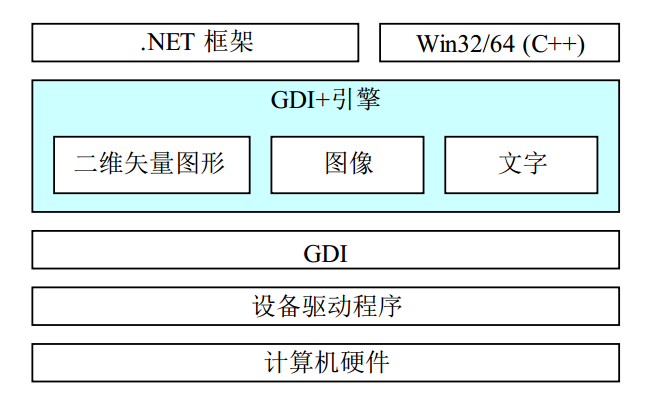

图 14-1 GDI+的体系结构

（2）GDI+平面 API 与封装

GDI+提供（expose）了一个平面（flat）API，它包含大约 600 个函数，被实现在 Gdiplus.dll 中，声明在 Gdiplusflat.h 内。这些函数被包装到了前面讨论过的 GDI+ API 的 54 个 C++类的 集合之中。

作为 C++封装的替代方案，微软.NET 框架提供了 GDI+的一个托管代码封装类集，包 含大约 60 个类、50 个枚举和 8 个结构。它们分属于下列命名空间：System.Drawing、 System.Drawing.Drawing2D 、 System.Drawing.Imaging 、 System.Drawing.Text 和 System. Drawing.Printing。

GDI+的平面 API 与其 C++及托管封装的关系如图 14-2 所示。

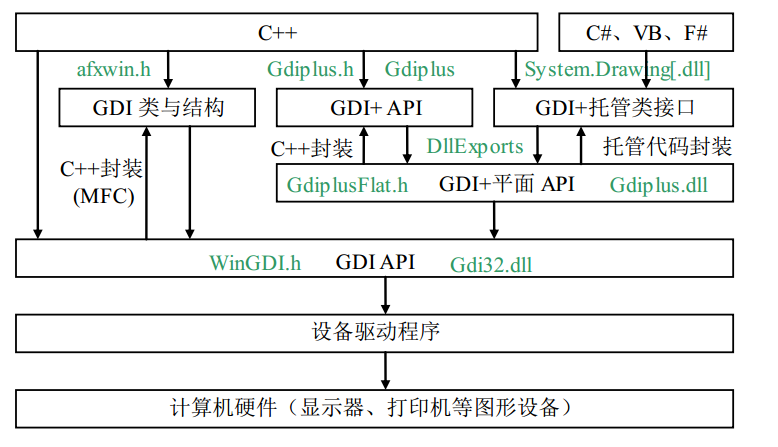

图 14-2 GDI+的封装与使用

## 1.2 GDI+的组成

GDI+的 C++封装，包含了 54 个类、12 个全局函数、（6 类）226 个图像常量、55 种枚 举和 19 种结构。GDI+的.NET 托管封装，则包含了大约 60 个类、50 个枚举和 8 个结构。这 两种封装都是基于 GDI+平面 API 的。本小节只介绍 GDI+的 C++封装，GDI+的托管封装将 在第 18 章的.NET 窗体绘图中有所涉及。

（1）类

GDI+的 C++封装中共有 54 个类，核心类是 Graphics，它是实际绘制直线、曲线、图形、 图像和文本的类。许多其它 GDI+类是与 Graphics 类一起使用的。例如，DrawLine 方法接收 Pen 对象，该对象中存有所要绘制的线条的属性（颜色、宽度、虚线线型等）。FillRectangle 方法可以接收指向 LinearGradientBrush 对象的指针，该对象与 Graphics 对象配合工作来用 一种渐变色填充矩形。Font 和 StringFormat 对象影响 Graphics 对象绘制文本的方式。Matrix 对象存储并操作 Graphics 对象的仿射变换——旋转、缩放和翻转图像。

GDI+还提供了用于组织图形数据的几种结构类（例如 Rect、Point 和 Size）。而且，某 些类的主要作用是结构化数据类型。例如，BitmapData 类是 Bitmap 类的帮助器，PathData 类是 GraphicsPath 类的帮助器。图 14-3 是 GDI+ API 类的层次结构图。

注意：在 GDI+、.NET、C#、Java 和 VB 中，都把类的成员函数称为方法。当我们在

C++中，使用 GDI+和.NET 框架类库中的类和功能时，也常常将其函数改称为方法。

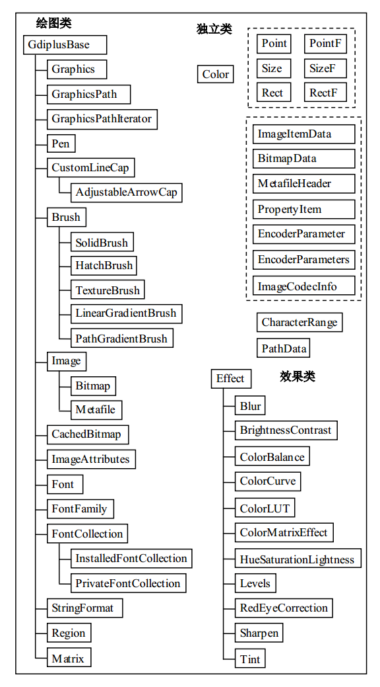

图 14-3 GDI+类的层次结构

（2）全局函数

GDI+命名空间中的全局函数有 12 个，常用的有如下两个（其余的大多数与图像相关）：

+ 关闭 GDI+：GdiplusShutdown（清除 GDI+所使用的资源）。

+ 启动 GDI+：GdiplusStartup（初始化 GDI+）。

（3）常量、枚举和结构

GDI+中有 6 类共计 226 个图像常量（都被定义在头文件 GdiplusImaging.h 中），包括图 像 文 件 格式 常 量 11 个（ 如 ImageFormatBMP 、 ImageFormatGIF 、 ImageFormatJPEG 、 ImageFormatPNG、ImageFormatTIFF 等）、图像帧维常量 2 个、图像编码器常量 13 个、图

像像素格式常量 14 个、图像特性标志类型 9 个、图像特性标志 217 个。

GDI+定义了 55 种枚举类型，它们都是相关常数的集合。例如：PenType、BrushType、DashStyle、ImageType、LineCap、FillMode、ImageFlags 等。

GDI+ API 中还定义了 19 种结构，用于 GDI+的各种方法调用中。例如：ColorMap、 ColorMatrix、ColorPalette、Gdiplus Abort、GdiplusStartupInput、GdiplusStartupOutput 等。

## 1.2 GDI+的特色

本节介绍 GDI+的几个主要新增特性与功能，说明 GDI+在编程模式上的改变。

### 1.2.1 GDI+新增特性

与 GDI 相比，GDI+新增的特性主要有渐变画刷、样条和贝塞尔曲线、持久路径、矩阵 变换、伸缩区域、α 混色和对多种图像格式的支持。

（1）渐变画刷

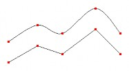

GDI+中新增加的渐变画刷（gradient brush，梯度刷），通过提供用于填充图形、路径和 区域的颜色线性渐变和路径渐变的画刷，扩展了 GDI 的功能。渐变画刷可用于绘制直线、 曲线和路径，参见图 14-4。

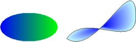

a)（水平）线性渐变 b)（贝塞尔）路径渐变

图 14-4 渐变画刷 图 14-5 基样条曲线与折线

（2）曲线方法

GDI+支持基样条（cardinal splines）和贝塞尔（Bezier）方法，可以由若干控制点生成 光滑的曲线，参见图 14-5。

（3）持久路径对象

GDI 中的路径（path）属于设备上下文，并且会在绘制时被毁坏。而 GDI+则可以创建 并维护多个与 Graphics 对象分开的持久（persistent）路径对象——GraphicsPath 对象，在绘 图操作时也不会破坏，因此可多次使用同一个 GraphicsPath 对象来绘制路径。

（4）变换和矩阵对象

GDI+提供了 Matrix（矩阵）对象，它是一种可以使（缩放、旋转和平移等）变换（transformation）简易灵活的强 大工具，矩 阵对象一般 与变换对 象联合使用 。例如，GraphicsPath 对象具有 Transform 方法，此方法接收 Matrix 对象作为参数。参见图 14-6。

（5）可伸缩区域

GDI+通过对可伸缩区域（scalable region）的支持极大地扩展了 GDI。在 GDI 中，区域 被存储在设备坐标中，而且，可应用于区域的惟一变换是平移。而 GDI+在全局坐标中存储 区域，并且允许区域发生任何可存储在变换矩阵中的变换（如缩放和旋转）。图 14-7 显示一 个区域在执行三种变换（缩放、旋转和平移）前后的情况。

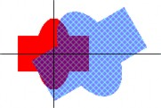

图 14-6 路径变换

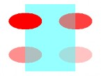

图 14-7 区域变换

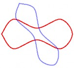

图 14-8 不同透明度

（6）α混色

在图 14-7 中，可以在变换区域（用蓝色阴影画笔填充）中看到未变换区域（用红色填充），这是由 GDI+支持的α 混色（alpha blending，透明混合）实现的。使用α 混色，可以指定填充颜色的透明度。透明色与背景色相混合———填充色越透明，透出的背景色就越多。 图 14-8 显示四个用相同颜色（红色）填充、但透明层次不同的椭圆。

（7）丰富的图像格式支持

GDI+提供 Image、Bitmap 和 Metaf ile 类，可以用不同的格式加载、保存和操作图像。 GDI+支持 BMP、GIF、JPEG、EXIF、PNG、TIFF、ICON、WMF、EMF 共 9 种常见的图像 格式。这些已经被 ATL/MFC 中的基于 GDI+的 CImage 类所体现。

（8）GDI+的不足

虽然，相对于 GDI 来说，GDI+确实增加了许多新特性，而且功能更强大，使用也更方 便。但是，这并不等于 GDI+就能够完全代替 GDI。

因为 GDI+实际上是 GDI 的高层封装和功能扩展，GDI+的执行效率一般要低于 GDI 的。 另外，GDI+不支持图形的位运算，那么就不能进行异或绘图等操作。而且在 Visual C++中， GDI+还不直接支持双缓存机制（如内存 DC 和显示 DC），这将大大影响 GDI+在高速图形、 图像、动画和视频等方面的应用。

### 1.2.2 编程模式的改变

GDI+的出现，也使基于 GDI 的编程模式产生了很大变化：GDI+用一个“无状态模式”， 取代了 GDI 中（需要先将各种工具和项目选入 DC 对象后，才能进行绘图的）“状态模式”。 主要体现在以下几个方面：

（1）DC 句柄和图形对象

设备上下文（DC）是 GDI 中使用的一种结构，用于存储与特定显示设备相关的的绘制 工具及属性的信息，用于屏幕显示的 DC 还与特定窗口相关联。为了使用 GDI API 进行绘图， 必须首先获得一个 DC 的句柄（HDC），然后将该句柄作为参数，传递给实际进行绘图的 GDI 函数。在 MFC 中，DC 及其绘图功能被封装在 CDC 类中，DC 句柄成为了成员变量，绘图 函数变成了方法，不再需要显式传递 HDC 参数。

使用 GDI+，不需要再（直接）使用句柄或设备上下文，而是只需（通过 HDC）创建一个 Graphics 对象，然后用熟悉的面向对象方式来调用其中的各种绘图方法，例如：

```
myGraphicsObject.DrawLine(&pen, x1, y1, x2, y2);
```

正如 DC 是 GDI 的核心，Graphics 对象也位于 GDI+的核心。DC 和 Graphics 对象的作 用相似，但在使用设备上下文（GDI）的基于句柄的编程模式和使用 Graphics 对象（GDI+） 的面向对象的编程模型之间，存在一些基本的差异。

Graphics 对象（像 DC 一样）与屏幕上的特定窗口关联，并具有指定如何绘制项目的属 性（如 SmoothingMode 和 TextRenderingHint）。但是，Graphics 对象不受笔、刷、路径、图 像或字体的约束，这与设备上下文不同。例如，使用设备上下文绘制线条之前，必须先调用 SelectObject 将笔选入 DC 中，以使笔对象和 DC 关联。在设备上下文中绘制的所有线条均 使用该笔，直到选择另一支不同的笔为止。在 GDI+中，将 Pen 对象作为参数传递给 Graphics 类的 DrawLine 等画线方法。可以在一系列的 DrawLine 调用的每个调用中，使用不同的 Pen 对象，而不必将给定的 Pen 对象与 Graphics 对象关联。

（2）画线的两种方法

下面每个示例都从点(20, 10)到点(200, 100)绘制一条宽为 3 的红色线条。第一个示例调 用 GDI，第二个示例则通过托管类接口调用 GDI+，这里都使用 MFC。也可以不使用 MFC， 而直接用 API 来进行 GDI+绘图（由于篇幅有限，这里就不介绍了）。

1）用 GDI 画线

利用 MFC 进行 GDI 绘图，步骤与 API 的差不多，只是 MFC 将各种 GDI 功能封装到了 不同的类中。例如，笔的类为 CPen、点的类为 CPoint、设备上下文的类为 CDC。而且所有 的绘图函数都被封在 CDC 类中，所以只能作为其对象的方法才能被使用，当然也就不用再 带 HDC 句柄作为输入参数了。

```
CDC *pDC = GetDC(); // 获取 DC 对象
CPen pen(PS_SOLID, 3, RGB(255, 0, 0)); // 创建笔
pDC->SelectObject(&pen); // 选笔入 DC
pDC->MoveTo(20, 10); // 将当前点移到直线的起点
pDC->LineTo(200, 100); // 从当前点画线到直线的终点
```

2）用 GDI+画线

利用 MFC 进行 GDI+绘图，步骤与 API 的差不多。只是代码改在 OnDraw 函数中，而且获取 DC 句柄的方法不同。

```
CDC *pDC = GetDC(); // 获取 DC 对象
Graphics myGraphics(pDC->m_hDC); // 利用 DC 句柄创建图形对象
Pen myPen(Color(255, 0 , 0), 3); // 创建笔
myGraphics.DrawLine(&myPen, 20, 10, 200, 100); // 画直线
```

（3）作为参数的绘图工具

前面的示例显示：在 GDI+中，创建和维护 Pen 对象，可以与提供绘制方法的 Graphics 对象分开。同样，创建和维护 Brush、GraphicsPath、Image 和 Font 对象也可以与 Graphics 对象分开，Graphics 类提供的许多绘制方法，都将笔、刷、路径、图像和字体等对象，作为 参数接收。例如，Brush 对象作为参数传递至 FillRectangle 方法，GraphicPath 对象作为参数 传递至 DrawPath 方法。同样，Image 和 Font 对象传递至 DrawImage 和 DrawString 方法。

这与 GDI 不同，在 GDI 中，需要先将笔、刷、路径、图像或字体等 GDI 工具对象选入 DC，然后（API）将 DC 的句柄作为参数传递至绘制函数或（MFC）采用 CDC 类对象的函 数使用 DC 中当前的笔、刷、路径、图像或字体来绘图。

（4）无当前位置

GDI+从总体上已经放弃了当前位置的概念，如在前面所述的 DrawLine 方法中线条的起 点和终点均被作为参数接收。这与 GDI 方案不同，在 GDI 中，调用 MoveToEx(hdc, x1, y1, NULL) 或 pDC-&gt;MoveTo(x1, y1)来设置当前笔位置之后，再调用 LineTo(hdc, x2 , y2) 或 pDC-&gt;LineTo(x2, y2)来绘制一条从(x1, y1)到(x2 , y2)的线条。

（5）绘制和填充的不同方法

GDI 的 Rectangle 和 Ellipse 等函数，可一步完成绘制轮廓和填充内部的功能。轮廓由当 前选定的笔绘制，而内部则由当前选定的刷来填充。GDI+则必须分别调用绘制轮廓和填充 内部的两个不同方法来做到这一点。例如，Graphics 类的 DrawRectangle 方法将 Pen 对象作 为其参数之一，而 FillRectangle 方法将 Brush 对象作为其参数之一。所以在绘制轮廓和填充 图形内部时，GDI+要比 GDI 更灵活，但也更麻烦。

（6）构造区域

GDI 提供几种用于创建区域的 函数（在 MFC 中，它们被 封装在 CRng 类里）： CreateRectRgn 、 CreateEllpticRgn 、 CreateRoundRectRgn 、 CreatePolygonRgn 和 CreatePolyPolygonRgn。您或许希望 GDI+中的 Region 类也有类似的构造函数，将矩形、椭 圆、圆角矩形和多边形作为参数接收，但事实并非如此。GDI+中的 Region 类提供一个接收 Rectangle 对象的构造函数和另一个接收 GraphicsPath 对象的构造函数。如果想基于椭圆、 圆角矩形或多边形构造区域，可以通过创建一个 GraphicsPath 对象（可包含椭圆的对象等）， 然后将其传递至 Region 构造函数来轻松实现。

GDI+通过组合图形和路径，使得构成复杂区域十分简单。Region 类具有 Union 和 Intersect 方法，可用于扩展具有路径的现有区域或其它区域。GDI+方案一个很好的功能就是 GraphicsPath 对象在作为参数传递至 Region 构造函数时不会被破坏（在 GDI 中，可以使用 PathToRegion 方法将路径转换为区域，但在此过程中，路径将被破坏）。另外，GraphicsPath 对象在作为参数传递给 Union 或 Intersect 方法时也不会被破坏，因此，在一些单独的区域中， 可以将给定的路径作为构造块使用。例如：

```
Region region1(rect1); 
Region region2(rect2); 
region1.Union(onePath); 
region2.Intersect(onePath);
```

## 1.3 GDI+的 MFC 编程

本节介绍利用 MFC 进行 GDI+编程的必要的准备，并通过例子说明 GDI+编程的具体步 骤，最后给出如何解决存在的 new 操作符问题的方法。

C++封装的 GDI+的（英文）帮助内容，位于 VS08 的“目录/Win32 和 COM 开发/Graphics and Multimedia/GDI+”，主要的参考资料位于其子目录“GDI+ Reference”中。

### 1.3.1 设置与初始化

封装了 GDI+ API 的各种 C++类、函数、常量、枚举和结构，都被定义在 Gdiplus.h 头 文件所包含的一系列头文件中。所以，采用 MFC 进行 GDI+编程，必须包含 Gdiplus.h 头文 件。

从 14.1.2 的有关 GDI+平面 API 的讨论可知，封装在 GDI+类中方法，最后都需要调用GDI+平面 API 中的相关底层函数，才能完成实际的操作。所以，为了运行 GDI+应用程序，在操作系统平台中，必须安装动态链接库 Gdiplus.dll。对 Windows XP 及以上版本，该 DLL已经自动被操作系统包含。

该动态链接库所对应的静态库文件为 GdiPlus.lib，而且它在 VC08 及之前的早期版本中 不是 C++和 MFC 的默认链接库。所以，对早期的 VC 版本必须在项目设置，添加该库作为 链接器输入的附加依赖项。但是对 VC08 SP1 及 VC10，该库已经成为标准链接库之一，不 必再为链接器输入的附加依赖项添加此库。

因为在 Gdiplus.h 头文件中，将所有的 GDI+的类、函数、常量、枚举和结构等都定义在 了命名空间 Gdiplus 中。所以，一般在 GDI+程序中，都应该使用如下的命名空间声明：

```
using namespace Gdiplus;
```

（1）VC 中的设置

为了在 MFC 应用程序中能使用 GDI+，必须包含 GDI+头文件、使用 GDI+命名空间。 对 VC08 及之前的版本，还要为项目添加 GDI+链接库。

1) 包含头文件、使用命名空间——在要使用 GDI+的文件（如视图类的头文件或代码 文件）头部包含 GDI+的头文件：

```
#include &lt;gdiplus.h&gt;
```

并加上使用 GDI+命名空间的 using 指令（区分大小写，注意首字母大写）：

```
using namespace Gdiplus;
```

2) 添加链接库（对 VC08 SP1 及 VC10 不必添加）——在 VS08 及其早期版本中，选 “项目/*属性”菜单项，打开项目的属性页窗口，先选“所有配置”，再选“配置 属性/链接器/输入”项，在右边上部的“附加依赖项”栏的右边，键入 GdiPlus.lib（参见图 14-9）后按“应用”钮，最后按“确定”钮关闭对话框。

（2）GDI+的初始化与清除

为了在 MFC 应用程序中使用采用 C++封装的 GDI+ API，必须在 MFC 项目的应用程序 类 中 ， 调 用 GDI+ 命 名 空 间 中 的 GDI+ 启 动 函 数 GdiplusStartup 和 GDI+ 关 闭 函 数 GdiplusShutdown，来对 GDI+进行初始化（装入动态链接库 Gdiplus.dll，或锁定标志+1）和 清除（卸载动态链接库 Gdiplus.dll，或锁定标志-1）工作。它们一般分别在应用程序类的InitInstance 和 ExitInstance 重载方法中调用。

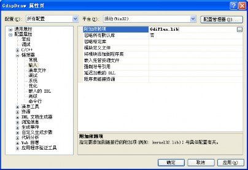

图 14-9 在项目属性对话框中添加静态链接库

函数 GdiplusStartup 和 GdiplusShutdown，都被定义在 GdiplusInit.h 头文件中：

```
Status WINAPI GdiplusStartup( OUT ULONG_PTR *token,
const GdiplusStartupInput *input, OUT GdiplusStartupOutput *output); 
void GdiplusShutdown(ULONG_PTR token);
```

其中：

类型 ULONG_PTR，是用无符号长整数表示的指针，被定义在 basetsd.h 头文件中：

```
typedef _W64 unsigned long ULONG_PTR;
```

输出参数 token（权标），供关闭 GDI+的函数使用，所以必须设置为应用程序类的 成员变量（或全局变量，不提倡）。

结构 GdiplusStartupInput 和 GdiplusStartupOutput，都被定义在 GdiplusInit.h 头文件中。

GDI+启动输入结构指针参数 input，一般取默认构造值即可，即（设：无调 试事件回调过程、不抑制背景线程、不抑制外部编解码）：

```
input = GdiplusStartupInput(NULL, FALSE, FALSE);
```

GDI+启动输出结构指针参数 output，一般不需要，取为 NULL 即可。 注意，采用 MFC 进行 GDI+ API 编程时，在使用任何 GDI+的功能调用之前，必须先调用 GDI+启动函数 GdiplusStartup 来进行初始化 GDI+的工作；在完成所有的 GDI+功能调用 之后，必须调用 GDI+关闭函数 GdiplusShutdown 来进行清除 GDI+的工作。

（3）过程框图

图 14-10 是使用 MFC 进行 GDI+编程的设置、准备与初始化过程的逻辑框图。

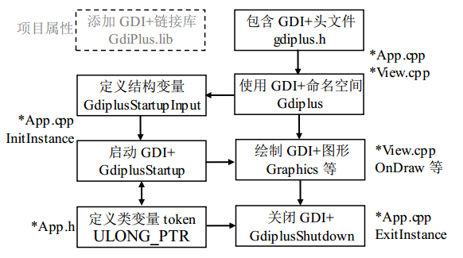

图 14-10 GDI+的设置、准备与初始化

### 1.3.2 编程例子

下面通过一个简单的例子，来说明如何使用 GDI+进行应用程序开发。

（1）创建和设置

创建一个名为 Gdip 的传统界面 MFC 单文档应用程序项目，在应用程序类和视图类的CPP 代码文件中，包含头文件并使用命名空间：

```
#include <gdiplus.h>
using namespace Gdiplus;
```

对 VC08 及之前的版本还需在项目属性中添加链接库 GdiPlus.lib。

（2）初始化与清除

然后再进行 GDI+系统的初始化，这需要在应用程序类 CGdipApp 中声明一个成员变量：

```
ULONG_PTR m_gdiplusToken; // ULONG PTR 为 int64 类型 并在该类的初始化函数 CGdipApp::InitInstance()中加入以下代码来对 GDI+进行初始化：
GdiplusStartupInput gdiplusStartupInput; 
GdiplusStartup(&m_gdiplusToken, &gdiplusStartupInput, NULL);
```

注意：这两个语句必须加在应用程序类的 InitInstance 函数中的

```
CWinApp::InitInstance();
```

语句之前，不然以后会造成视图窗口不能自动重画、程序中不能使用字体等等一系列问题。

还要在 CGdipApp::ExitInstance()中加入以下代码来关闭 GDI+：

```
GdiplusShutdown(m_gdiplusToken);
```

上面的 InitInstance 和 ExitInstance 都是应用程序类的重写型方法。而且，默认时 VC08 SP1 及其以前版本是不会自动生成 ExitInstance 方法代码的（不过 VC10 会自动生成此方法），需 要自己利用属性窗口来添加（不要手工添加）。

（3）绘图

接下来就可以利用 GDI+进行绘图了。下面的代码段是在 OnDraw 函数中画一个带网格 的透明度连续变化的图：

```
CGdipView::OnDraw(CDC* pDC) {
    ……
    Graphics graph(pDC-&gt;m_hDC); // 创建图形对象
    Pen bluePen(Color(0, 0, 255)); // 创建蓝色笔
    Pen redPen(Color(255, 0, 0)); // 创建红色笔
    int y = 255; // y 的初值
    for (int x = 0; x &lt; 256; x += 5) { // 绘制红蓝网线
        graph.DrawLine(&bluePen, 0, y, x, 0);
        graph.DrawLine(&redPen, 255, x, y, 255);
        y -= 5;
    }
    // 画一组绿色透明度垂直渐变的水平线（填满正方形）
    for (y = 0; y &lt; 256; y++) {
        Pen pen(Color(y, 0, 255, 0)); // α 随 y 变的绿色笔
    graph.DrawLine(&pen, 0, y, 255, y);
    }
    // 画一组品红色透明度水平渐变的垂直线（填满扁矩形）
    for (int x = 0; x &lt; 256; x++) {
        Pen pen(Color(x, 255, 0, 255)); // α 随 x 变的品红色笔
        graph.DrawLine(&pen, x, 100, x, 200);
    }
}
```

运行的结果如图 14-11 所示。其中，左图为第一个循环所绘制的结果、中图为前两个循 环所绘制的结果、右图为全部三个循环所绘制的结果。

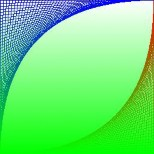

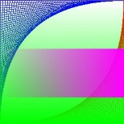

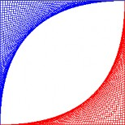

图 14-11 透明度的连续变化

### 1.3.3 new 问题

在 VC08（包括 SP1）中使用 GDI+时，不能用 new 来动态创建 GDI+对象。解决办法有 如下两种：

（1）修改 GdiplusBase 类

打开（默认）位于“C:\Program Files\Microsoft SDKs\Windows\v6.0A\ Include\”目录中 的 Gdiplus Base.h 头文件，并注释掉里面 Gdiplus Base 类的内容（该类其实只含 new、new[]、 delete 和 delete[]这四个运算符的重载），使其成为一个空类（但不要删除整个类）。

为了不修改原始安装目录中的 Gdiplus Base.h 头文件，可以：

+ 将该头文件复制到你的项目目录中。

+ 注释掉该头文件里面 Gdiplus Base 类的内容（保留类定义）。

+ 在项目中所有的#include <gdiplus.h>语句之前，包含"Gdiplus Base.h"头文件，形如：

  ```
  #include "gdiplusBase.h"
  #include &lt;gdiplus.h&gt;
  ```

+ 则编译系统会优先包含项目目录中的 gdiplus Base.h 头文件，从而屏蔽掉原来位于 平台 SDK 的 Include 目录中的同名头文件。

（2）用&代替 new

也可以在有些使用 new 的地方改用&，例如将代码 Pen *pPen = **new** Pen(Color::Red); 改 为 Pen *pPen = **&**Pen(Color::Red);。

## 1.4 几何辅助类

与 GDI 的类似，在 GDI+ API 中也定义了许多绘图的辅助类，常用的有点、大小和矩形 等几何类。它们都是没有基类的独立类，被定义在头文件 GdiplusTypes.h 中。与 GDI 不同 的是，在 GDI+中新增加了浮点型的几何类。

浮点数版的几何对象和绘图方法，是 GDI+新增的功能，这些在各种工程技术领域都非 常有用。因为一般的实际图形设计，都是基于实数坐标的。包括机械（../轮船/飞机 等）、建筑（../道路/堤坝等）和图形动画设计（../../轨迹等）等设 计，都必须使用浮点参数和坐标系。

下面对 GDI+的几何辅助类，逐个进行简单的介绍。

### 1.4.1 Point[F]（点）

GDI+中，有两种类型的点：整数点（对应于 Point 类，与 GDI 的 MFC 类 CPoint 类似） 和浮点数点（对应于 PointF 类），下面分别加以介绍。

（1）整数点类 Point

```
class Point 
{ 
public:
    Point() {X = Y = 0;}
    Point(const Point &point) {X = point.X; Y = point.Y;} 
    Point(const Size &size) {X = size.Width; Y = size. Height;} 
    Point(INT x, INT y) {X = x; Y = y;}
    Point operator+(const Point& point) const {return Point(X + point.X, Y + point.Y);}
    Point operator-(const Point& point) const {return Point(X - point.X, Y - point.Y);} 
    BOOL Equals(const Point& point) {return (X == point.X) && (Y == point.Y);}
public:
    INT X; INT Y; // 大写 X、Y
};
```

其中：typedef int INT; 为 4 字节有符号整数（windef.h）。 注意，GDI+的点与 GDI 的区别：POINT 和 CPoint 采用小写的 x、y。

（2）浮点数点类 PointF

```
class PointF 
{ 
public:
    PointF() {X = Y = 0.0f;}
    PointF(REAL x, REAL y) {X = x; Y = y;}
    ... // 与整数版的类似
public:
    REAL X; REAL Y;
};
```

其中：typedef float REAL; 为 4 字节浮点数（GdiplusTypes.h）。

### 1.4.2 Size[F]（大小）

GDI+中，也有两种类型的大小（尺寸）：整数大小（对应于 Size 类，与 GDI 的 MFC 类 CSize 类似）和浮点数大小（对应于 SizeF 类）。下面分别加以介绍：

（1）整数大小类 Size：

class Size 
{ 
public:
    Size() {Width = Height = 0;}
    Size(INT width, INT height) {Width = width; Height = height;}
    ...
public:
    INT Width; 
    INT Height; // 宽和高，不再是 cx 和 cy
};

注意，这里的大小与 GDI 的区别：SIZE 和 CSize 的分量成员为 cx 和 cy，不是宽和高。

（2）浮点数大小类 SizeF：

```
class SizeF 
{ 
public:
    SizeF() {Width = Height = 0.0f;}
    SizeF(REAL width, REAL height) {Width = width; Height = height;}
    ...
public:
    REAL Width; REAL Height;
};
```
### 1.4.3 Rect[F]（矩形）

GDI+中，也有两种类型的矩形：整数矩形（对应于 Rect 类，与 GDI 的 MFC 类 CRect 类似）和浮点数矩形（对应于 RectF 类），下面分别加以介绍。

（1）整数矩形类 Rect：

```
class Rect 
{ 
public:
    Rect() {X = Y = Width = Height = 0;}
    Rect(INT x, INT y, INT width, INT height);
    ...
    INT GetLeft() const {return X;} INT GetTop() const {return Y;}
    INT GetRight() const {return X+Width;} INT GetBottom() const {return Y+Height;}
    BOOL IsEmptyArea() const{return (Width &lt;= 0) || (Height &lt;= 0);} BOOL Equals(const Rect & rect) const;
    BOOL Contains(INT x, INT y) const; BOOL **Contains**(const Point& pt) const; BOOL Contains(Rect& rect) const;
    ...
    VOID Offset(const Point& point); VOID Offset(INT dx, INT dy);
public:
    INT X; INT Y; // 大写的 X 和 Y（为矩形左上角的坐标），不再是 left 和 top 
    INT Width; 
    INT Height; // 宽和高，不再是 right 和 bottom
};
```

注意，这里的矩形与 GDI 的区别：RECT 和 CRect 的分量成员是左、顶、右、底而不 是 X、Y、宽、高。虽然 Rect 中的(X, Y)等价于 RECT 的(left, top)，但是 Rect 中的(Width, Height) 却不同于 RECT 的(right, bottom)。

（2）浮点数矩形类 RectF：

```
class RectF 
{ 
public:
    RectF() {X = Y = Width = Height = 0.0f;}
    RectF(REAL x, REAL y, REAL width, REAL height);
    ...
public:
    REAL X; 
    REAL Y;
    REAL Width; 
    REAL Height;
};
```

在 GDI 的 MFC 封装中，除了定义有点、大小和矩形的类外，还保留了对应的 API 结构 POINT、SIZE 和 RECT，主要是考虑运行效率及与底层 GDI API 的兼容。

比较可知，GDI 和 GDI+都有对应的几何类，不过 GDI+没有对应的结构（但有新增加 的浮点数版类），而 GDI 则没有对应的浮点数版类（但却有对应的结构）。

## 1.5 颜色

与 GDI 相比，GDI+的颜色新增了一个透明分量，并且定义了颜色类 Color。

### 1.5.1 颜色类型 ARGB

GDI+中的颜色，与 GDI 中的颜色的最大不同，是增加了一个字节（8 位）的透明分量 alpha（α ），用来表示颜色的不透明度：0 透明（看不见前景色，只有背景色）~255 不透明（看不见背景色，只有前景色，相当于覆盖和拷贝）。背景色指屏幕窗口中原有图形的颜色， 前景色指将要绘制图形的颜色。

因此，GDI+中的颜色一般都是用四个字节表示（Intel CPU 中，多字节整数的低位在前）：

+ 整数序（高位→低位）：

  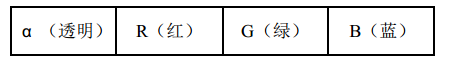

+ 字节序（低字节→高字节）：

  

在 GDI 中没有专门的颜色类，只有一个颜色类型 COLORREF，也定义为： 

```
typedef DWORD COLORREF; // 0x00bbggrr (windef.h)
```

和一个生成颜色的宏：

```
COLORREF RGB( BYT E bRed, BYTE bGreen, BYT E bBlue);
```

其中：

```
typedef unsigned char BYTE; // 单字节无符号字符整数
```

在 GDI+中，也将颜色数据定义为无符号 4 字节长整数类型 DWORD，但是改名为 ARGB： 

```
typedef DWORD ARGB; // gdipluspixelformats.h
```

### 1.5.2 颜色类 Color

而且 GDI+中还定义了专门的 Color 类，不仅包含了此颜色数据，而且还有多个构造函 数和其他辅助方法、枚举和常量。

Color 类的构造函数中，最常用的是：

```
Color( BYTE a, BYTE r, BYT E g, BYTE b); // a 为 alpha 分量α 但也有一个默认构造函数：
Color( VOID); // 不透明黑色，相当于 Color(255, 0, 0, 0);
```

还有一个与 GDI 兼容的构造函数：

```
Color( BYTE r, BYTE g, BYTE b); // 不透明色，相当于 Color(255, r, g, b);
```

你也可以直接用含颜色数据的 4 字节无符号整数，来构造 Color 类的对象：

```
Color( ARGB argb); // 相当于 Color(a, r, g, b);
```

该整数可以由 Color 类的静态方法 MakeARGB 或动态方法 GetValue 获得：

```
static ARGB MakeARGB( BYT E a, BYTE r, BYTE g, BYTE b);
ARGB GetValue(VOID);
```

你还也可以用 Color 类的方法：

```
COLORREF ToCOLORREF() const;
```

将 Color 对象中的颜色，转换为 GDI 的颜色类型。

Color 类还提供了各个颜色分量的获取方法及其简化版：

```
BYTE GetAlpha() const; 
BYTE GetA() const; 
BYTE GetRed() const; 
BYTE GetR() const; 
BYTE GetGreen() const; 
BYTE GetG() const; 
BYTE GetBlue() const; 
BYTE GetB() const;
```

你也可以先用宏：

```
BYTE GetRValue(DWORD rgb); // COLORREF rgb 
BYTE GetGValue(DWORD rgb); // COLORREF rgb 
BYTE GetBValue(DWORD rgb); // COLORREF rgb
```

获取 COLORREF 的 R、G、B 值，然后再用这些值调用 Color 类的构造函数来创建 Color 对象。例如：

```
COLORREF crCol = colDlg.GetColor(); 
BYTE r = GetRValue(crCol),
     g = GetGValue(crCol), 
     b = GetBValue(crCol);
Color col(r, g, b); // Color col(crCol | (255<<24));
```

### 1.5.3 颜色枚举常量

GDI+在颜色头文件 GdiplusColor.h 中，定义了 141 个公用颜色枚举常量，都是对应颜色 的英文单词。可以用 Color 类直接访问，例如：Color ::Red。

下面是部分颜色枚举常量（按字母顺序排列）：

```
public:
    // Common color constants 通用颜色常量
    enum {
        AliceBlue = 0xFFF0F8FF, // 艾丽丝蓝
        AntiqueWhite = 0xFFFAEBD7, // 古董白
        Aqua = 0xFF00FFFF, // 水绿
        Aquamarine = 0xFF7FFFD4, // 碧绿
        Azure = 0xFFF0FFFF, // 天蓝
        Beige = 0xFFF5F5DC, // 米色
        Bisque = 0xFFFFE4C4, // 汤黄
        Black = 0xFF000000, // 黑
        BlanchedAlmond = 0xFFFFEBCD, // 布兰奇杏黄
        Blue = 0xFF0000FF, // 蓝
        BlueViolet = 0xFF8A2BE2, // 蓝紫
        Brown = 0xFFA52A2A, // 棕褐
        ...
        Tan = 0xFFD2B48C, // 茶色
        Teal = 0xFF008080, // 水鸭青
        Thistle = 0xFFD8BFD8, // 蓟色
        Tomato = 0xFFFF6347, // 番茄红
        Transparent = 0x00FFFFFF, // 透明
        Turquoise = 0xFF40E0D0, // 宝石绿
        Violet = 0xFFEE82EE, // 紫罗兰
        Wheat = 0xFFF5DEB3, // 小麦色
        White = 0xFFFFFFFF, // 白
        WhiteSmoke = 0xFFF5F5F5, // 烟白
        Yellow = 0xFFFFFF00, // 黄
        YellowGreen = 0xFF9ACD32 // 黄绿
    };
```

图 14-12 是各种颜色枚举字符常量（包括中文译名）所对应的色块表（按字母顺序排列）。

## 1.6 图形类 Graphics

与 GDI 的 MFC 类 CDC 类似，GDI+的绘图功能主要由图形类 Graphics 承担。

图形类 Graphics 是 GDI+的核心，它提供绘制图形、图像和文本的各种方法（似 GDI 中的 CDC 类），还可以存储显示设备和被画项目的属性（到图元文件）。Graphics 类及其方 法都被定义在头文件 Gdiplusgraphics.h 中。

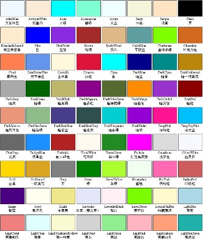

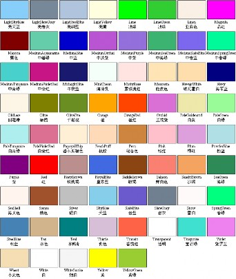

图 14-12 颜色枚举常量

### 1.6.1 构造函数

Graphics 类的构造函数有如下 4 种：

```
Graphics(Image* image); // 用于绘制图像
Graphics(HDC hdc); // 用于在当前窗口中绘图
Graphics(HDC hdc, HANDLE hdevice); // 用于在制定设备上绘制图形
Graphics(HWND hwnd, BOOL icm = FALSE); // 用于在指定窗口中绘图 
```

其中，最常用的是第二种——在当前视图窗口中绘图的图形类构造函数。

注意，该构造函数的输入参数，是设备上下文的句柄，而不是 CDC 类对象的指针。一 般可以由 CDC 对象得到（因 CDC 类含有公用数据成员 HDC m_hDC;）：

+ 在 OnDraw 函数中，利用输入参数 CDC *pDC，就可直接得到 DC 句柄。例如：

  ```
  Graphics graph(pDC-&gt;m_hDC);
  ```

+ 在视图类的其他函数中，可先利用 GetDC 函数得到 CDC 指针，然后再利用它去获 取 DC 的句柄。例如：

  ```
  Graphics graph(GetDC()-&gt;m_hDC);
  ```

也可以使用 Graphics 类的另一个构造函数 `Graphics(HWND hwnd, BOOL icm = FALSE);`，利用视图类的窗口句柄成员来构造 Graphics 对象。例如：

```
Graphics graph(this-&gt;m_hWnd);
```

### 1.6.2 状态枚举 status

在图形类 Graphics 中，封装了各种绘图方法。每种绘图方法被调用后，都会返回一种 叫做 status 的枚举值，反映该方法是否被正确执行，0 表示正确，其他大于 0 的值为错误代 码（GdiplusTypes.h）：

```
typedef enum { // 状态枚举（含 22 个枚举值）
    Ok = 0,
    GenericError = 1,
    InvalidParameter = 2,
    OutOfMemory = 3,
    ...
    PropertyNotSupported = 20,
    ProfileNotFound = 21
} Status;
```

GDI+的绘图功能被封装在图形类 Graphics 中，下面介绍其中的常用绘图方法。先讲绘 制线型图的方法，再讲绘制填充图的方法，最后讲绘制文字的方法。

### 1.6.3 画线型图的方法

GDI+中绘制线型图形的方法与 GDI 的类似，也包括绘直线、矩形、椭圆和多边形等， 但是 GDI+增加了浮点版本和若干新功能。GDI+的画线函数都是 Graphics 类的方法，而且所 有方法的名称都是以 Draw 开头。

（1）画直线[折线]DrawLine[s]

在 GDI+中定义了 6 种绘制直线和折线的方法，前三个为整数版，后三个为对应的浮点 数版：

```
Status DrawLine(const Pen* pen, INT x1, INT y1, INT x2, INT y2);
Status DrawLine(const Pen* pen, const Point& pt1, const Point& pt2); 
Status DrawLines(const Pen* pen, const Point* points, INT count);
Status DrawLine(const Pen* pen, REAL x1, REAL y1, REAL x2, REAL y2);
Status DrawLine(const Pen* pen, const PointF& pt1, const PointF& pt2); 
Status DrawLines(const Pen* pen, const PointF* points, INT count);
```

其中：

+ DrawLine——画直线（4 个重载），参数 pen 为画直线所用的笔、(x1, y1)和 pt1 为 直线的起点、(x2, y2)和 pt2 为直线的终点。GDI 的相应函数为 MoveTo 和 LineTo。

+ DrawLines——画折线（一串相互连接的直线段）（2 个重载），参数 points 为点数 组、count 为数组中点的数目。GDI 的相应函数为 Polyline。

（2）画矩形[组] DrawRectangle[s]

在 GDI+中也定义了 6 种绘制矩形和矩形组的方法，也是前三个为整数版，后三个为对 应的浮点数版：

```
Status DrawRectangle(const Pen* pen, const Rect& rect);
Status DrawRectangle(const Pen* pen, INT x, INT y, INT width, INT height); 
Status DrawRectangles(const Pen* pen, const Rect* rects, INT count);
Status DrawRectangle(const Pen* pen, const RectF& rect);
Status DrawRectangle(const Pen* pen, REAL x, REAL y, REAL width, REAL height); 
Status DrawRectangles(const Pen* pen, const RectF* rects, INT count);
```

其中：

+ DrawRectangle——画单个矩形（4 个重载），参数 pen 为画矩形所用的笔、rect 为 矩形区域、(x, y)为矩形的左上角、(width, height)为矩形的大小（宽，高）。与 GDI 的对应函数 BOOL Rectangle( int x1, int y1, int x2, int y2);的区别主要是 GDI+的第 2 个和第 4 个画矩形方法的后两个输入参数，不再是 GDI 中的矩形右下角的坐标， 而改成矩形的宽和高了。

+ DrawRectangles——画多个矩形（2 个重载），参数 rects 为矩形数组、count 为数组 中矩形的数目。GDI 中没有同时绘制一个矩形数组的函数。

（3）[椭]圆 DrawEllipse

GDI+中有 4 个重载的绘制椭圆的方法，如果输入参数所确定的外接矩形的宽高相等， 则画圆。也是前两个为整数版，后两个为对应的浮点数版：

```
Status DrawEllipse(const Pen* pen, const Rect& rect);
Status DrawEllipse(const Pen* pen, INT x, INT y, INT width, INT height) Status DrawEllipse(const Pen* pen, const RectF& rect);
Status DrawEllipse(const Pen* pen, REAL x, REAL y, REAL width, REAL height);
```

这些方法的功能，与 GDI 中的函数：

```
BOOL Ellipse( int x1, int y1, int x2, int y2 );
```

图 14-13 画弧方法的输入参数

类似，但是同样要注意 GDI+的 DrawEllipse 方法与 GDI 的 Ellipse 函数的主要区别（与画矩 形的方法与函数类似），是上面的以坐标为参数的第 2、4 个 GDI+画椭圆方法的后两个输入 参数，也是矩形的宽高而不再是矩形的右下角坐标了。

（4）画[椭]圆弧 DrawArc

GDI+中也有 4 个重载的绘制椭圆弧的方法，如果输入参数所确定的外接矩形的宽高相 等，则画圆弧。也是前两个为整数版，后两个为对应的浮点数版。

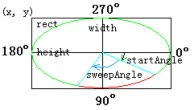

```
Status DrawArc(const Pen* pen, INT x, INT y, INT width, INT height, REAL startAngle, REAL sweepAngle);
Status DrawArc(const Pen* pen, const Rect& rect, REAL startAngle, REAL sweepAngle);
Status DrawArc(const Pen* pen, REAL x, REAL y, REAL width, REAL height, REAL startAngle, REAL sweepAngle);
Status DrawArc(const Pen* pen, const RectF& rect, REAL startAngle, REAL sweepAngle);
```

注意，角度的单位是度（不是弧度，C++的三角函数 采用的是弧度单位），而且都必须是实数。零度角为 x 轴 方向，顺时针方向为正（这与数学上反时针方向为正刚好相反），参见图 14-13。

（5）画多边形 DrawPolygon

GDI+中有 2 个重载的绘制多边形的方法，前一个为整数版，后一个为对应的浮点数版：

```
Status DrawPolygon(const Pen* pen, const Point* points, INT count); 
Status DrawPolygon(const Pen* pen, const PointF* points, INT count);
```

其中，各参数的含义同画折线方法 DrawLines 的，只是 DrawPolygon 方法会将点数组中的起点和终点连接起来，形成一个封闭的多边形区域。 该方法的功能与 GDI 的 Polygon 函数相同：

```
BOOL Polygon( LPPOINT lpPoints, int nCount );
```

注意：GDI+中没有提供与 GDI 函数 RoundRect（圆角矩形）和 Chord（弓弦）具有类 似功能的绘图方法，但可以利用矩形+椭圆和弧+直线等方法来自己实现。

### 1.6.4 画填充图的方法

在 GDI 中，任何画封闭区域的性状图绘制函数（如矩形、圆角矩形、[椭]圆、弓弦和多 边形等），都可以画填充图，因为它们总是在用当前笔画指定边框的同时，也用当前刷子填 充内部区域。

而 GDI+的画线方法就没有这个功能，因为在 GDI+是无状态的，没有当前笔和刷的概 念。为了完成与这些 GDI 函数类似的功能，在 GDI+中，你得分两步来做：先用填充方法填 充区域内部，再用画线方法绘制边框。

在 GDI+中画填充图，不需像 GDI 那样得先将刷子选入 DC，而是与 GDI+画线状图的 方法类似，将刷子作为画填充图方法的第一个输入参数。注意，GDI+中的画填充图的方法 都以 Fill 开头。

（1） 画填充矩形[组]FillRectangle[s]

GDI+中有 6 个重载的绘制填充矩形[组]的方法，前 3 个为整数版，后 3 个为对应的浮点 数版：

```
Status FillRectangle(const Brush* brush, const Rect& rect);
Status FillRectangle(const Brush* brush, INT x, INT y, INT width, INT height); 
Status FillRectangles(const Brush* brush, const Rect* rects, INT count);
Status FillRectangle(const Brush* brush, const RectF& rect);
Status FillRectangle(const Brush* brush, REAL x, REAL y, REAL width, REAL height);
Status FillRectangles(const Brush* brush, const RectF* rects, INT count);
```

用指定刷子 Brush，填充 rect 的内部区域，无边线，填充区域包括矩形的左边界和上边 界，但不包括矩形的右边界和下边界。功能与 GDI 的 FillRect 函数类似：

```
void FillRect( LPCRECT lpRect, CBrush* pBrush );
```

但是，GDI 中没有同时填充一个矩形数组的函数。不过 GDI 却有 GDI+中所没有的画填充圆 角矩形的函数 FillSolidRect。

（2） 画填充椭圆 FillEllipse

GDI+中有 4 个重载的绘制填充椭圆的方法，前 2 个为整数版，后 2 个为浮点数版：

```
Status FillEllipse(const Brush* brush, const Rect& rect);
Status FillEllipse(const Brush* brush, INT x, INT y, INT width, INT height); 
Status FillEllipse(const Brush* brush, const RectF& rect);
Status FillEllipse(const Brush* brush, REAL x, REAL y, REAL width, REAL height); 
```

GDI 中没有类似函数，但可以用（采用当前刷填充的）Ellipse 函数来代替。

（3） 画饼图 DrawPie

GDI+中有 4 个重载的绘制饼图的方法，前 2 个为整数版，后 2 个为浮点数版：

```
Status DrawPie(const Pen* pen, const Rect& rect, REAL startAngle, REAL sweepAngle);
Status DrawPie(const Pen* pen, INT x, INT y, INT width, INT height, REAL startAngle, REAL sweepAngle);
Status DrawPie(const Pen* pen, const RectF& rect, REAL startAngle, REAL sweepAngle);
Status DrawPie(const Pen* pen, REAL x, REAL y, REAL width, REAL height, REAL startAngle, REAL sweepAngle);
```

与 GDI 的下列函数类似，但是部分输入参数的含义有所不同：

```
BOOL Pie( int x1, int y1, int x2, int y2, int x3, int y3, int x4, int y4 );
BOOL Pie( LPCRECT lpRect, POINT ptStart, POINT ptEnd );
```

例如（参见图 14-14）：

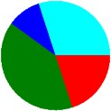

```
void DrawPies(Graphics &graph, const Color cols[], Point &O, int r, const float data[], int n) {
    Rect rect(O.X - r, O.Y - r, 2 * r, 2 * r);
    float startAngle = 0, sweepAngle; 
    for (int i = 0; i &lt; n; i++) {
        sweepAngle = data[i] * 360.0f; 
        graph.FillPie(&SolidBrush(cols[i]), rect, startAngle, sweepAngle);
        startAngle += sweepAngle;
    }
}
void CGdipDrawView::OnDraw(CDC* pDC) {
    ……
    Graphics graph(pDC-&gt;m_hDC);
    Color cols[] = {Color::Red, Color::Green, Color::Blue, Color::Aqua};
    float data[] = {0.2f, 0.4f, 0.1f, 0.3f}; 
    DrawPies(graph, cols, Point(200, 200), 100, data, 4);
    ……
}
```

（4） 画填充多边形 FillPolygon

GDI+中有 4 个重载的绘制填充多边形的方法，前 2 个为整数版，后 2 个为浮点数版：

```
Status FillPolygonconst Brush* brush, const Point* points, INT count); 
Status FillPolygon(const Brush* brush, const Point* points, INT count, FillMode fillMode);
Status FillPolygon(const Brush* brush, const PointF* points, INT count);
Status FillPolygon(const Brush* brush, const PointF* points, INT count, FillMode fillMode);
```

其中，填充模式参数 FillMode，可取如下两个值之一（参见 8.5.3 中的 1．）：

```
typedef enum {
    FillModeAlternate, // 交替模式——按奇偶规则填充（默认模式）
    FillModeWinding // 环绕模式——按非零环绕规则填充
} FillMode;
```

对简单图形，这两种模式的效果是一样的，但对复杂图形，特别是有穿插的图，结果可 能是不同的。例如（画五角星，参见图 14-15）：

```
// 定义五角星顶点数组
const int n = 5; 
Point p1(100, 0); 
Point p2(195, 69); 
Point p3(159, 181);
Point p4(41, 181); Point p5(5, 69); 
Point ps0[n] = {p1, p2, p3, p4, p5};
Point ps[n] = {p1, p3, p5, p2, p4};
// 创建实心刷对象
SolidBrush redBrush(Color(128, 0, 0));
SolidBrush greenBrush(Color(0, 128, 0));
SolidBrush blueBrush(Color(0, 0, 128));
// 画五角星
Graphics graph(pDC->m_hDC); 
graph.DrawPolygon(&Pen(Color::Red), ps0, n); 
graph.DrawPolygon(&Pen(Color::Green), ps, n);
// 画填充五角星
graph.TranslateTransform(200, 0); // 右移 200 像素
graph.FillPolygon(&redBrush, ps0, n); 
graph.TranslateTransform(200, 0); 
graph.FillPolygon(&greenBrush, ps, n, FillModeAlternate); 
graph.TranslateTransform(200, 0); 
graph.FillPolygon(&blueBrush, ps, n, FillModeWinding);
```

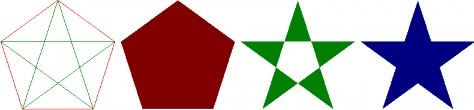

多边形 交替/环绕模式 交替模式 环绕模式 

图 14-15 填充多边形（五角星）

GDI 中也没有与画填充多边形类似的专门函数，但可以用（采用当前刷填充的）Polygon 来代替。

### 1.6.5 画曲线的方法

前面讲的各种画线状图或填充图的 GDI+方法，虽然在形式上与 GDI 的有所不同（方法 名前加了 Draw 或 Fill、将笔或刷作为第一个输入参数、部分输的位置入参数改成了大小参 数、并增加了浮点数版），但是在功能上却是相同的。

现在要讲的曲线绘制，则是 GDI+新增加的内容。曲线在机械设计、工程建筑和图形动 画等领域，都有十分广泛应用。

常用的曲线有 Bezier（贝塞尔）曲线和样条（spline）曲线。贝塞尔曲线比较简单，适 合于画控制点少的曲线。当控制点太多时，要不曲线的次数（比点数少 1）太高，要不拼接 比较困难，而且没有局部性（即修改一点影响全局），性能不太好。而样条曲线则可以画任 意多个控制点的曲线，曲线的次数也可以指定（一般为二次或三次），并且具有局部性。贝 塞尔曲线特别是样条曲线有很多变种。常见的贝塞尔曲线有普通贝塞尔曲线和有理贝塞尔曲 线。常用的样条曲线有：B 样条、β 样条、Hermite（厄密）样条、基样条（cardinal splines）、 Kochanek- Bartels 样条和 Catmull-Rom 样条等。

GDI+中所实现的是普通贝塞尔曲线（不过控制点，位于控制多边形的凸包之内）和基 样条曲线（过控制点）。有关曲线和曲面构造方法，会在课程《计算机图形学》中介绍。

（1）基样条曲线（cardinal spline curve）

```
Status DrawCurve(const Pen* pen, const Point* points, INT count, REAL tension = 0.5f); 
Status DrawCurve(const Pen* pen, const PointF* points, INT count, REAL tension = 0.5f); 
Status DrawClosedCurve(const Pen *pen, const Point* points, INT count, REAL tension = 0.5f);
Status DrawClosedCurve(const Pen *pen, const PointF* points, INT count, REAL tension = 0.5f);
```

其中：

+ 参数 tension（张力）指定曲线的弯曲程度，tension = 0.0（直线）~1.0（最弯曲）。

+ DrawClosedCurve 方法（连接首尾点）画封闭的基样条曲线。 例如（参见图 14-16）：

```
void DrawPoints(Graphics &graph, const Color &col, int r, const Point* points, INT count) { 
    // 自定义的画点列函数 SolidBrush brush(col);
    for (int i = 0; i < count; i++) 
        graph.FillEllipse(&brush, Rect(points[i].X - r,
            points[i].Y - r, 2 * r, 2 * r));
}
Graphics graph(pDC->m_hDC);
// 定义 Pen 对象和 Point 对象的数组
Pen greenPen(Color::Green, 3);
Point p1(10, 100), p2(100, 50), p3(300, 10), p4(400, 100);
Point ps[4] = {p1, p2, p3, p4};
// 绘制不同张力的基样条曲线
graph.DrawCurve(&Pen(Color::Magenta), ps, 4, 1.0);
graph.DrawCurve(&greenPen, ps, 4, 0.5);
graph.DrawCurve(&Pen(Color::Blue), ps, 4, 0.0); 
DrawPoints(graph, Color::Red, 5, ps, 4); // 绘制曲线的控制点
// 绘制默认张力的基样条、封闭基样条与贝塞尔曲线
graph.TranslateTransform(450, 0); // 水平右移 450 个像素
graph.DrawCurve(&greenPen, ps, 4);
graph.DrawClosedCurve(&Pen(Color::Aqua), ps, 4);
graph.DrawBeziers(&Pen(Color::Chocolate), ps, 4); 
DrawPoints(graph, Color::Red, 5, ps, 4); // 绘制曲线的控制点
```

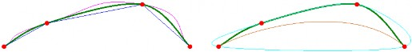

不同张力的基样条曲线 基样条、封闭基样条与贝塞尔曲线 

图 14-16 基样条曲线与贝塞尔曲线

（2）贝塞尔曲线（Bezier curve）

```
Status DrawBezier(const Pen* pen, INT x1, INT y1, INT x2, INT y2, INT x3, INT y3, INT x4, INT y4);
Status DrawBezier(const Pen* pen, const Point& pt1, const Point& pt2, const Point& pt3, const Point& pt4);
Status DrawBeziers(const Pen* pen, const Point* points, INT count);
... // 对应的浮点版本
```

（3）填充封闭基样条曲线

```
Status FillClosedCurve(const Brush* brush, const Point* points, INT count);
Status FillClosedCurve(const Brush* brush, const Point* points, INT count, FillMode fillMode, REAL tension = 0.5f);

... // 对应的浮点版本
```

例如，将前面画图 14-15 所对应的填充多边形例子中的画填充五角星的三个语句中的 FillPolygon 方法，改为填充封闭基样条曲线方法 FillClosedCurve，结果如图 14-17 所示。

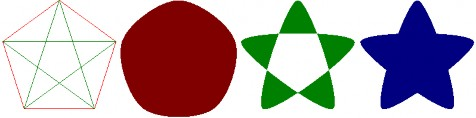

多边形 交替/环绕模式 交替模式 环绕模式 

图 14-17 填充闭曲线

### 1.6.6 平滑处理

可以利用 Graphics 类的设置平滑模式方法

```
Status SetSmoothingMode(SmoothingMode smoothingMode);
```

来设置绘图时的平滑化处理。其中的输入参数为枚举类型：

```
typedef enum {
    SmoothingModeInvalid = QualityModeInvalid, //无效（保留）
    SmoothingModeDefault = QualityModeDefault, // 默认（低质，无平滑处理） 
    SmoothingModeHighSpeed = QualityModeLow, // 高速（低质，无平滑处理） 
    SmoothingModeHighQuality = QualityModeHigh, // 高质（使用 8*4 盒过滤器） 
    SmoothingModeNone, // 无平滑处理
    SmoothingModeAntiAlias8x4, // 使用 8*4 盒过滤器（库中无） 
    SmoothingModeAntiAlias = 
    SmoothingModeAntiAlias8x4, // 使用 8*4 盒过滤器 
    SmoothingModeAntiAlias8x8 // 使用 8*8 盒过滤器（最高质，库中也无）
} SmoothingMode;
```

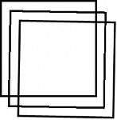

图 14-18 平滑处理

例如（参见图 14-18）：

```
Graphics graph(pDC-&gt;m_hDC); 
Pen pen(Color::Black, 4);
Rect rect(10, 10, 200, 200);
graph.DrawRectangle(&pen, rect); 
graph.RotateTransform(1); 
graph.TranslateTransform(20, 20);
//graph.SetSmoothingMode(SmoothingModeNone);
graph.DrawRectangle(&pen, rect); 
graph.TranslateTransform(20, 20); 
graph.SetSmoothingMode(SmoothingModeAntiAlias); 
graph.DrawRectangle(&pen, rect);
```

### 1.6.7 清屏方法 Clear

GDI 中没有用于清屏的专门函数，得自己用背景色画窗口大小的填充矩形，或者调用窗 口类的 Invalidate 和 UpdateWindow 函数。现在，GDI+有了清屏方法 Clear：

```
Status Clear(const Color &color);
```

其中的输入参数 color，为用户指定的填充背景色。例如：

```
Graphics graph(GetDC()->m_hDC);
…… 
graph.Clear(Color::White);
```

## 1.7 笔和刷

本节介绍 GDI+的两类绘图工具——笔和刷，它们与 GDI 的相比新增加了许多功能。

### 1.7.1 笔

与 GDI 中的一样，GDI+中的笔（pen）也是画线状图的工具，但是功能更加强大。例 如：透明笔、图案笔、自定义虚线风格、线帽、笔的缩放和旋转、笔的连接点属性等。

GDI+中的笔对应于 Pen 类，被定义在 GdiplusPen.h 头文件中。 笔的构造方法主要有两个：


```
Pen(const Color &color, REAL width = 1.0); // 单色笔
Pen(const Brush *brush, REAL width = 1.0); // 纹理图案笔
```

其中，最常用的是第一个，它构造一个颜色为 color，宽度为 width（默认为 1）的单色笔。 如果颜色的α 值&lt;255，则所创建的笔就是带透明度的笔。

（1）笔对齐

当笔宽大于 1 时，默认情况下，是以笔的中心与绘图坐标对齐。但是，也可以采用 Pen类的方法：

```
Status SetAlignment(PenAlignment penAlignment);
```

设置为内对齐，其输入参数取枚举类型 PenAlignment 的符号常量：

```
typedef enum {
    PenAlignmentCenter = 0, // 中心对齐（默认值）
    PenAlignmentInset = 1 // 内对齐
} PenAlignment;
```

例如（输出结果如图 14-19 所示）：

```
Graphics graph(pDC-&gt;m_hDC); 
Rect rect(20, 20, 300, 200);
Pen pen(Color::Green, 30), redPen(Color::Red); 
graph.DrawEllipse(&pen, rect); 
graph.DrawRectangle(&redPen, rect); 
pen.SetAlignment(PenAlignmentInset); 
graph.TranslateTransform(340, 0); 
graph.DrawEllipse(&pen, rect); 
graph.DrawRectangle(&redPen, rect);
```

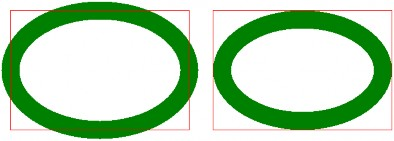

a) 中心对齐（默认值） b) 内对齐

图 14-19 笔对齐

（2）图案笔

笔类 Pen 的第二个构造方法，是从刷子来创建笔，如果是单色的实心刷，则相当于第一 个笔构造方法。如果刷子为条纹（影线）或纹理（图像）等图案刷，则该构造函数所创见的 就是对应的图案笔。

例如（条纹笔画椭圆，参见图 14-20）：

```
HatchBrush hBrush(HatchStyleCross, Color::Green, Color::Red); // 创建十字线条纹刷 
Pen hPen(&**hBrush**, 40); // 创建宽度为 40 像素的条纹笔 
graph.DrawEllipse(&hPen, 20, 20, 400, 250); // 画椭圆
```

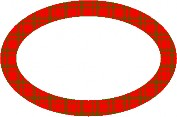

图 14-20 条纹笔椭圆

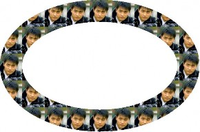

图 14-21 纹理笔椭圆 

又例如（纹理笔画椭圆，参见图 14-21）：

```
Image img(L"张东健.bmp"); // 创建图像对象，并装入图像文件
TextureBrush tBrush(&img); // 创建纹理刷
Pen tPen(&**tBrush**, 80); // 创建宽度为 80 像素的纹理笔 
Graphics graph(GetDC()-&gt;m_hDC); // 创建图形对象 
graph.DrawEllipse(&tPen, 40, 40, 640, 400); // 画椭圆
```

（3）线型

与 GDI 一样，对 GDI+中的笔，也可以设置线型。所用的方法为：

```
Status SetDashStyle(DashStyle dashStyle);
```

其中的输入参数，为虚线风格枚举 DashStyle：（GdiplusEnums.h） 

```
enum DashStyle {
    DashStyleSolid, // 0 实线 （默认值）
    DashStyleDash, // 1 虚线
    DashStyleDot, // 2 点线：
    DashStyleDashDot, // 3 虚点线：
    DashStyleDashDotDot, // 4 虚点点线 
    DashStyleCustom // 5 自定义虚线
};
```

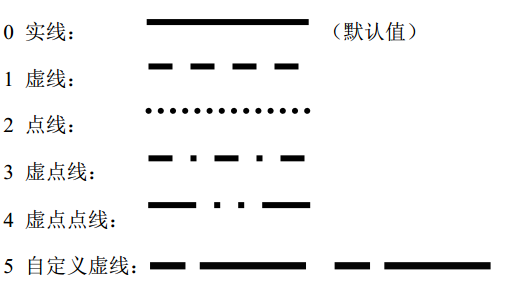

可以用 Pen 类的另一个方法来获取笔的线型：

```
DashStyle GetDashStyle() const; 
```

GDI+中的线型，大多数与 GDI 中的相同，区别主要有两点：

+ GDI 中的非实线线型，对宽度&gt;1 的笔无效；而 GDI+的笔对任意非零宽度的笔都是有效的。

+ GDI+中新增了一种风格——自定义虚线风格。 具体的自定义虚线风格，由 Pen 类的设置虚线图案的方法

```
Status SetDashPattern(const REAL *dashArray, INT count);
```

来设置，其中的实数数组 dashArray 含若干个正实数（单位为像素），按线、空、线、空、„„ 的交叉方式排列；参数 count 为数组中实数的个数（须&gt;0）。

例如（参见图 14-22）：

```
Graphics graph(pDC->m_hDC);
Pen pen(Color::Black, 8); // 创建宽 8 个像素的黑色笔（画虚线用）
// 线 5、空 2、线 15、空 4（像素）
REAL dashVals[4] = {5.0f, 2.0f, 15.0f, 4.0f};
FontFamily fontFamily(L"Times New Roman"); // 创建字体族对象
// 创建 5 号字大小的 Times New Roman 字体
Font font(&fontFamily, 10.5);
// 创建绿色的实心刷（写字符串用）
SolidBrush brush(Color(0, 128, 0));
// 笔的虚线风格枚举常量的名称字符串数组
CString strs[] = {L"DashStyleSolid", L"DashStyleDash", L"DashStyleDot", L"DashStyleDashDot", L"DashStyleDashDotDot", L"DashStyleCustom"};
for (int i = 0; i &lt;= 5; i++) { // 绘制各种风格的虚线及其名称串
    pen.**SetDashStyle**((DashStyle)i); // 设置笔的虚线风格
    // 设置自定义虚线图案
    if (i == 5) pen.SetDashPattern(dashVals, 4);
    // 画虚线
    graph.DrawLine(&pen, 10, 10 + i * 20, 400, 10 + i * 20);
    // 绘制虚线风格枚举常量名称字符串
    graph.DrawString(strs[i], -1, &font,
        PointF(410, 2 + i * 20), &brush);
}
```

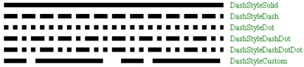

图 14-22 虚线风格

还可以用 Pen 类的另一个方法来获取笔的自定义虚线图案数据：

```
INT GetDashPatternCount(VOID); // 获取虚线数组中实数的个数
Status GetDashPattern(REAL *dashArray, INT count); // 获取虚线数组
```

（4）线帽

线帽（line cap）是指线条两端的外观，默认为正方形，也可以用 Pen 类的下列方法来 设置不同的线端形状：

```
Status SetStartCap(LineCap startCap); // 设置起点的线帽
Status SetEndCap(LineCap endCap); // 设置终点的线帽
// 设置起点、终点和虚线的线帽
Status SetLineCap(LineCap startCap, LineCap endCap, DashCap dashCap);
```

其中的线帽枚举 LineCap 为（GdiplusEnums.h）： 

```
typedef enum {
    LineCapFlat = 0, // 平线，直线起点位于平线的中点（默认值）
    LineCapSquare = 1, // 方形，高度=线宽，直线起点位于正方形中心 
    LineCapRound = 2, // 圆形，直径=线宽，直线起点位于圆心 
    LineCapTriangle = 3, // 三角，高度=线宽，直线起点位于其底边中点 
    LineCapNoAnchor = 0x10, // 无锚，同平线
    LineCapSquareAnchor = 0x11, // 方形锚，高度&gt;线宽，直线起点位于正方形中心 LineCapRoundAnchor = 0x12, // 圆形锚，直径&gt;线宽，直线起点位于圆心 LineCapDiamondAnchor = 0x13, // 菱形锚，高度&gt;线宽，直线起点位于菱形中心 LineCapArrowAnchor = 0x14, // 箭头锚，高度&gt;线宽，直线起点位于箭头的尖点 LineCapCustom = 0xff // 自定义线帽
} LineCap;
```
自定义线帽，需要用到 GDI+专门为此定义的类 CustomLineCap。其构造函数为：


```
CustomLineCap(const GraphicsPath *fillPath, const GraphicsPath *strokePath, LineCap baseCap, REAL baseInset);
```

其中要用到图形路径类 GraphicsPath，该类中有图形各种添加图形方法，只是把 Graphics 类

绘图方法名中的 Draw 改成 Add 即可。例如：AddLine、AddRectangle 和 AddPolygon 等。使 用时，可以先创建一个空路径，然后调用这些添加图形方法若干次，就可以生成路径了。

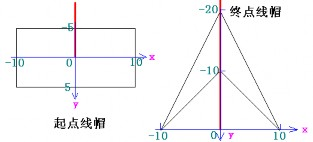

例如（各类线帽，参见图 14-23 和图 14-24）：

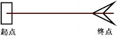

箭头线帽 构造箭头线帽头尾所使用的坐标系 

图 14-23 自定义线帽

```
// 自定义箭头线帽
GraphicsPath startPath, endPath; // 创建起点和终点路径对象
startPath.AddRectangle(Rect(-10, -5, 20, 10)); // 起点矩形
Point polygonPoints[4] = {Point(0, -20), Point(10, 0),
Point(0, -10), Point(-10, 0)};
endPath.AddPolygon(polygonPoints, 4); // 终点箭头 
CustomLineCap startCap(NULL, &startPath); // 创建起点线帽 
CustomLineCap endCap(NULL, &endPath); // 创建终点线帽
// 定义笔
Pen pen(Color::Black, 20); // 画带线帽粗线的黑笔
Pen redPen(Color::Red); // 画不带线帽细线的红笔
// 中英文线帽字符串数组
CString cstrs[] = {L"平线帽", L"方线帽", L"圆线帽", L"三角线帽",
L"无锚线帽", L"方锚线帽", L"圆锚线帽", L"菱锚线帽", L"箭锚线帽", L"定制线帽"};
CString estrs[] = {L"LineCapFlat", L"LineCapSquare",
    L"LineCapRound", L"LineCapTriangle", L"LineCapNoAnchor", L"LineCapSquareAnchor", 
    L"LineCapRoundAnchor", L"LineCapDiamondAnchor", L"LineCapArrowAnchor", 
    L"LineCapCustom"};
// 创建字体
FontFamily fontFamily(L"Times New Roman"); // 对应中文的"宋体" 
Font font(&fontFamily, 10.5); // 五号字
// 绘制各种线帽
Graphics graph(pDC-&gt;m_hDC);
for (int i = 0; i &lt;= 9; i++) { 
    // 画线循环
    LineCap lc = (LineCap)(i &lt; 4 ? i : i + 12); // 线帽常量（整数） 
    if(i &lt; 9) 
        pen.SetLineCap(lc, lc, DashCapFlat); // 标准线帽 
    else 
    { 
        // 自定义线帽（i = 9）
        pen.SetCustomStartCap(&startCap); // 设置自定义的起点线帽 
        pen.SetCustomEndCap(&endCap); // 设置自定义的终点线帽 
        pen.SetWidth(3.0f); // 重新设置线宽为 3 个像素
    }
    int y = 20 + i * 40; // 计算直线的垂直坐标 
    graph.DrawLine(&pen, 100, y, 400, y); // 画带线帽的粗线 
    graph.DrawLine(&redPen, 100, y, 400, y); // 画不带线帽的细线
    // 绘制中英文线帽字符串
    graph.DrawString(cstrs[i], -1, &font,
    PointF(15.0f, y - 8.0f), &brush); 
    graph.DrawString(estrs[i], -1, &font,
    PointF(425.0f, y - 8.0f), &brush);
}
```

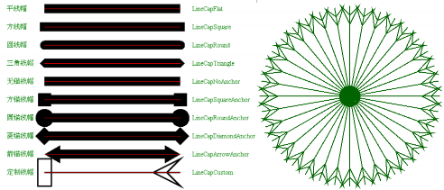

图 14-24 线帽的种类 图 14-25 箭头线帽的旋转直线簇 又例如（旋转箭头线帽，参见图 14-25）：

```
// startCap 和 endCap 的创建同上例，需包含头文件 &lt;math.h&gt;
Pen pen(Color::DarkGreen, 2); 
pen.SetCustomStartCap(&startCap); 
pen.SetCustomEndCap(&endCap);
double radian = 3.14159265358979323846 / 180.0;
for (int i = 0; i &lt; 360; i += 10) 
    graph.DrawLine(&pen, 220, 220, 220 + (INT) (200 *
        cos(i * radian)), 220 + (INT) (200 * sin(i * radian)));
```

方法 SetLineCap 的最后一个输入参数 DashCap dashCap，用于设置虚线内部各线段端点 的形状。其取值是枚举类型（GdiplusEnums.h）：

```
typedef enum {
    DashCapFlat = 0, // 平线（默认值） 
    DashCapRound = 2, // 圆形 
    DashCapTriangle = 3 // 三角
} DashCap; 
```

可见，只有三种选择：平、圆和三角。之所以枚举常量所对应的值不连续，是因为要同 LineCap 枚举的对应常量一致。

注意，虚线帽的设置，只影响其虚线内部的线段，不会影响整条虚线的头尾形状，它们 是由 SetLineCap 方法的前两个参数来分别设置的。例如（参见图 14-26）：

```
Graphics graph(pDC-&gt;m_hDC);
Pen pen(Color::Black, 10);
pen.SetLineCap(LineCapFlat, LineCapFlat, **DashCapFlat**);
//pen.SetLineCap(LineCapFlat, LineCapFlat, **DashCapRound**);
//pen.SetLineCap(LineCapFlat, LineCapFlat, **DashCapTriangle**); 
REAL dashVals[4] = {5.0f, 2.0f, 15.0f, 4.0f};
for (int i = 0; i &lt;= 5; i++) 
{
    pen.SetDashStyle((DashStyle)i);
    if (i == 5) 
        pen.SetDashPattern(dashVals, 4);
    graph.DrawLine(&pen, 10, 10 + i * 20, 400, 10 + i * 20);
}
```

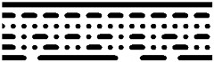

DashCapRound 圆虚线帽

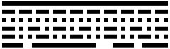

DashCapFlat 平虚线帽

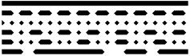

DashCapTriangle 三角虚线帽 

图 14-26 虚线帽

（5）线连接

笔的线连接（join）属性，也是 GDI+新增的功能。可以使用 Pen 类的方法：

```
Status SetLineJoin( LineJoin lineJoin);
```

来设置笔的线连接属性。其中输入参数为枚举类型 LineJoin： 

```
enum LineJoin {
    LineJoinMiter = 0, // 斜接（默认值）
    LineJoinBevel = 1, // 斜截
    LineJoinRound = 2, // 圆角
    LineJoinMiterClipped = 3 // 斜剪
};
```

例如（参见图 14-27）：

```
Graphics graph(pDC-&gt;m_hDC); 
Pen pen(Color::DarkGreen, 40); 
for (int i = 0; i &lt; 4; i++) 
{
    pen.SetLineJoin((LineJoin)i);
    graph.DrawRectangle(&pen, 40 + i * 150, 40, 100, 100);
}
```

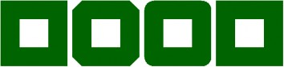

LineJoinMiter LineJoinBevel LineJoinRound LineJoinMiterClipped

斜接 斜截 圆角 斜剪 

图 14-27 线连接

从该例还看不出斜剪与斜接有什么区别，因为斜剪 LineJoinMiterClipped 主要针对交角 很小，相交部分很长的情形。在斜剪线连接方式下，可以调用 Pen 类的方法

```
Status SetMiterLimit(REAL miterLimit);
```

来设置相交部分的最大限制长度，默认是 10.0（相对于线宽的比值）。

对 LineJoinMiterClipped 方式的线连接，如果 miterLimit &lt; 相交部分的长度，则会截断 至线头（同斜截方式，相当于 miterLimit = 1.0）；如果 miterLimit &gt;= 相交部分的长度，则绘 制完整的相交部分。

但是对 LineJoinMiter 方式的线连接，如果 miterLimit &lt; 相交部分的长度，则会截断至

miterLimit 所指定比例的长度；如果 miterLimit &gt;= 相交部分的长度，则绘制完整的相交部分。 例如（参见图 14-28）：

```
Graphics graph(pDC-&gt;m_hDC);
Pen redPen(Color::Red); // 画细线的红笔
Pen pen(Color::DarkGreen, 40.0f); // 画粗线的绿色笔
Point points[] = {Point(20, 100), Point(400, 130),
Point(20, 160)}; // 点数组
pen.SetLineJoin(LineJoinMiter); // 斜接
//pen.SetLineJoin(LineJoinBevel); // 斜截
//pen.SetLineJoin(LineJoinRound); // 圆角
//pen.SetLineJoin(LineJoinMiterClipped); // 斜剪
//pen.SetMiterLimit(20.0f); // 设置斜接限长 
graph.DrawLines(&pen, points, 3); // 画粗线 
graph.DrawLines(&redPen, points, 3); // 画细线
```

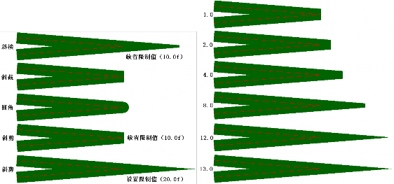

图 14-28 小交角线连接 图 14-29 不同斜接限长下的斜接线连接 如果不断修改斜接线连接 LineJoinMiter 方式下的线长限制（0.0f~13.0f），则可得到不同

截断长度的斜交角。例如（参见图 14-29）： 

```
pen.SetLineJoin(LineJoinMiter); // 斜接 
pen.SetMiterLimit(1.0f/*~13.0f*/); // 设置斜接限长
```

### 1.7.2 刷

与 GDI 中的一样，GDI+中的刷（brush）也是画填充图的工具，GDI+中也有与 GDI 相 对应的实心刷（单色刷）、条纹刷（影线刷）和纹理刷（图像刷）。不过，GDI+又新增加了 功能强大的线性渐变刷和路径渐变刷，而且还为所有这些刷各自建立了对应的类，基类是Brush（功能少）。


图 14-30 是 GDI+中各种刷类的层次结构图， 所有刷类都被定义在头文件 Gdiplus Brush.h 中。

（1）刷基类 Brush

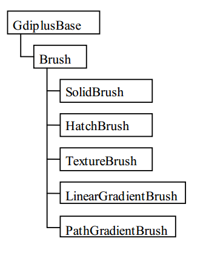

Brush 是所有 GDI+具体刷类的基类，Brush 类没有自己的公用构造函数，属于非实例化

类（用户不能创建 Brush 类的对象和实例），只是定义了三个公用的方法（接口）： 

```
Brush *Clone( VOID) const; // 克隆，用于复制 Brush 及其派生类对象 Status 
GetLastStatus(VOID); // 获取最后状态，返回刷对象最近的错误状态
BrushType GetType(VOID); // 获取类型，返回当前（派生）刷的类型枚举常量 
```

下面是 BrushType 枚举类型的定义（GdiplusEnums.h）：

```
typedef enum {
    BrushTypeSolidColor = 0, // 实心单色刷 
    BrushTypeHatchFill = 1, // 影线条纹填充刷 
    BrushTypeTextureFill = 2, // 图像纹理填充刷 
    BrushTypePathGradient = 3, // 路径渐变刷 
    BrushTypeLinearGradient = 4 // 线性渐变刷
} BrushType;
```

（2）实心刷类 SolidBrush

GDI+中，实心的单色刷对应于 SolidBrush 类，它只有一个构造函数：


```
SolidBrush(const Color &color);
```

输入参数为颜色对象的引用。

在前面的例子中已经多次使用了 SolidBrush 类，下面再举一个画正叶曲线的例子，下面 是正叶曲线的极坐标方程及其到直角坐标系的转换公式：

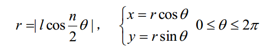


其中，l 为叶片长度、n 为叶片数目。

因为 GDI+并没有画正叶曲线的专门函数，所以需要用多边形、样条曲线或图形路径来 刻画它。可以使用填充多边形、填充封闭曲线和填充图形路径等方式来进行绘制，下面的代码使用的是填充闭基样条曲线，输出结果如图 14-31 所示。

+   绘制单个正叶曲线的函数代码：

    ```
    #include <math.h>
    void DrawLeaves(Graphics &graph, const Color col, Point &O,
        int l, int n) {
        double radian = 3.14159265358979323846 / 180.0; 
        int m = n < 5 ? 21 : 11;
        int N = m * n;
        double da = 360.0 / N; PointF *ps = new PointF[N];
        for (int i = 0; i &lt; N; i++) {
            double r = abs(l * cos(radian * (n * i * da)/ 2.0)), 
                x = r * cos(i * da * radian),
                y = r * sin(i * da * radian);
            ps[i].X = REAL(O.X + x);
            ps[i].Y = REAL(O.Y + y);
        }
        graph.FillClosedCurve(&SolidBrush(col), ps, N);
    }
    ```

+   绘制系列彩色正叶曲线的调用序列：

```
Graphics graph(pDC-&gt;m_hDC);
Color cols[] = {Color::Aqua, Color::Aquamarine, Color::DarkBlue, Color::DarkKhaki, 
    Color::DeepPink, Color::BlueViolet, Color::Brown, Color::BurlyWood, Color::CadetBlue, 
    Color::Chartreuse, Color::Turquoise, Color::Coral, Color::CornflowerBlue, 
    Color::Crimson, Color::DarkCyan};
bool color = true; // false; 
for (int i = 0; i &lt; 15; i++)
    DrawLeaves(graph, color ? cols[i] : Color::Green,
        Point(100 + 200* (i % 5), 100 + 200 * (i / 5)), 100, i + 1);
```

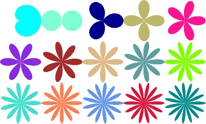

图 14-31 彩色正叶曲线系列

（3）条纹刷类 HatchBrush

条纹是一种重复填充的小方形图案，一般为横线、竖线、斜线和小方块等构成。GDI+ 中，条纹刷（hatch brush 影线刷/阴影刷）对应于 HatchBrush 类，它也只有一个构造函数：
```
HatchBrush(HatchStyle hatchStyle, const Color &foreColor, const Color &backColor = Color());
```

其中：第一个参数为条纹类型，第二个参数为前景色（条纹色），第三个参数为背景色（空隙色）。

GDI+中一共有 53 种条纹风格，而 GDI 中只有前 6 种。条纹风格枚举 HatchStyle 也被定 义在头文件 GdiplusEnums.h 中：

```
enum HatchStyle {
    HatchStyleHor izontal, // 0：横线
    HatchStyleVertical, // 1：竖线
    HatchStyleForwardDiagonal, // 2：正斜线
    HatchStyleBackwardDiagonal, // 3：反斜线
    HatchStyleCross, // 4：十字线
    HatchStyleDiagonalCross, // 5：斜十字线
    HatchStyle05Percent, // 6：5%
    HatchStyle10Percent, // 7：10%
    ...
    HatchStyleSphere, // 47：球面
    HatchStyleSmallGrid, // 48：小网格
    HatchStyleSmallChecker Board, // 49：小跳棋盘
    HatchStyleLargeCheckerBoard, // 50：大跳棋盘
    HatchStyleOutlinedDiamond, // 51：斜纲线
    HatchStyleSolidDiamond, // 52：实菱形 HatchStyleTotal, // = 53（0 ~ 52）：条纹风格总数 HatchStyleLargeGrid = HatchStyleCross, // 4：大网格
    HatchStyleMin = HatchStyleHorizontal, // 0：条纹风格最小值 HatchStyleMax = HatchStyleTotal - 1, // 52：条纹风格最大值
};
```

例如（参见图 14-32）：

```
Graphics graph(pDC-&gt;m_hDC); Pen pen(Color::Black);
SolidBrush textBrush(Color::Red);
FontFamily fontFamily(L"Times New Roman"); 
Font font(&fontFamily, 18);
CString str;
StringFormat sfmt; // 文本格式 
sfmt.SetAlignment(StringAlignmentCenter); // 水平对齐 
sfmt.SetLineAlignment(StringAlignmentCenter); // 垂直对齐
int w = 50, h = 50, s = 5;
for (int i = 0; i &lt; 53; i++) { // 主循环
    HatchBrush brush(HatchStyle(i), Color::Black, Color::White); 
    RectF rect(REAL(s + (i % 10) * (w + s)),
    REAL(s + (i / 10) * (h + s)), REAL(w), REAL(h));
    graph.FillRectangle(&brush, rect); // 画条纹块 
    str.Format(L"%d", i); // 绘制数字编号的文本串： 
    graph.DrawString(str, str.GetLength(), &font, rect,
        &sfmt, &textBrush);
}
```

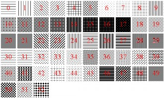

图 14-32 条纹刷的条纹风格

与 GDI 一样，在 GDI+中也可以调整条纹刷和图像刷的起点。这需要使用图像类 Graphics 的方法 SetRenderingOrigin 来设置渲染原点为(x, y)（默认为(0, 0)）：

```
Status SetRenderingOrigin(INT x, INT y);
```

（4）纹理刷类 TextureBrush

纹理刷（texture brush）就是图像刷，它将刷中所装入的图像，在目标区域中进行平铺， 可达到纹理效果。GDI 中也有图像刷，但仅限于使用位图资源和（非常费事才能使用）BMP 文件。在 GDI+中，纹理刷所对应的是 TextureBrush 类，它有 7 个构造函数，最常用的为：

```
TextureBrush(Image* image, WrapMode wrapMode = WrapModeTile);
```

其中，第一个参数是图像对象的指针，第二个参数是排列方式的枚举常量（GdiplusEnums.h）：

```
typedef enum {
    WrapModeTile = 0, // 平铺（瓦）（默认值）
    WrapModeTileFlipX = 1, // 平铺且 X 向翻转（相邻列左右翻转） 
    WrapModeTileFlipY = 2, // 平铺且 Y 向翻转（相邻行上下翻转） 
    WrapModeTileFlipXY = 3, // 平铺且 XY 向翻转（相邻行列左右上下翻转） 
    WrapModeClamp = 4 // 不平铺（不重复，夹住）
} WrapMode;
```

还可以用纹理刷类的下面两个方法来设置和获取刷的排列方式：

```
Status SetWrapMode(WrapMode wrapMode); WrapMode GetWrapMode() const;
```

例如（参见图 14-33）：

```
Graphics graph(pDC-&gt;m_hDC); 
Image img(L"张东健.bmp");
TextureBrush brush(&img, WrapModeTile/*FlipXY*/);
//TextureBrush brush(&img, **WrapModeClamp**); 
RECT rect;
GetClientRect(&rect);
graph.FillRectangle(&brush, RectF(0.0f, 0.0f, REAL(rect.right), REAL(rect.bottom)));
```

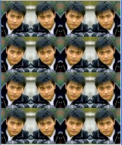

平铺（WrapModeTile）

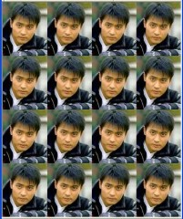

平铺且 X 向翻转（WrapModeTileFlipX）

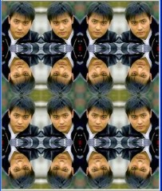

平铺且 Y 向翻转（WrapModeTileFlipY）

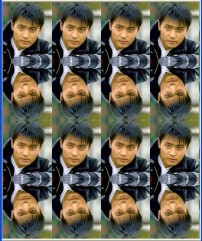

平铺且 XY 向翻转（WrapModeTileFlipXY）

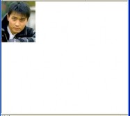

不平铺（WrapModeClamp） 

图 14-33 纹理刷排列方式

纹理刷类 TextureBrush 中，还有几个方法，可以对刷中的图像进行平移（translate）、旋 转（rotate）和缩放（scale）等变换（transform）（这是 GDI 里所没有的功能）：

```
Status TranslateTransform(REAL dx, REAL dy, MatrixOrder order = MatrixOrderPrepend); 
Status RotateTransform(REAL angle, MatrixOrder order = MatrixOrderPrepend) ;
Status ScaleTransform(REAL sx, REAL sy, MatrixOrder order = MatrixOrderPrepend);
```

例如（参见图 14-34）：

```
Graphics graph(pDC-&gt;m_hDC); Image img(L"张东健.bmp"); 
TextureBrush brush(&img);
//brush.TranslateTransform(30, 30); // 平移(30, 30)
brush.RotateTransform(30); // 旋转 30 度
//brush.ScaleTransform(3, 1); // 水平放大 3 倍
//brush.ScaleTransform(1, 3); // 垂直放大 3 倍
RECT rect; 
GetClientRect(&rect);
graph.FillRectangle(&brush, RectF(0.0f, 0.0f, REAL(rect.right), REAL(rect.bottom)));
```


平移(30, 30)


旋转 30 度


水平放大 3 倍

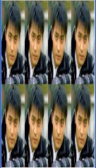

垂直放大 3 倍

图 14-34 纹理刷变换

（5）线性渐变刷类 LinearGradientBrush

线性渐变刷（linear gradient brush 线性梯度刷）使用逐渐变化的颜色填充目标区域。是 GDI+新增的功能。线性渐变刷所对应的类为 LinearGradientBrush，它有 6 个构造函数，前 3 个是整数版，后 3 个是对应的浮点数版。下面是 3 个整数版的构造函数：

```
LinearGradientBrush(const Point& point1, const Point& point2, const Color& color1, const Color& color2);
LinearGradientBrush(const Rect& rec t, const Color& color1, const Color& color2, LinearGradientMode mode);
LinearGradientBrush(const Rect& rect, const Color& color1, const Color& color2, REAL angle, BOOL is AngleScalable = FALSE);
```

在这三种构造函数中，第一个是点到点、第二个是矩形与渐变模式、第三个是是矩形与旋转角度。限于篇幅，这里只介绍其中点到点的整数版构造函数的具体使用方法。

1）点到点渐变

点到点的渐变是指刷子所填充的颜色，沿着点 point1 到点 point2 的直线，从颜色 color1 连续变化到 color2。若 p1 和 p2 点的 y 值相等，则为水平方向的渐变；若 p1 和 p2 点的 x 值 相等，则为垂直方向的渐变；p1 和 p2 点的 x 和 y 值都不相等，则为斜对角方向的渐变。

例如（参见图 14-35）：

```
Graphics graph(pDC->m_hDC);
Point p1(10, 10), p2(110, 10), p3(10, 110), p4(230, 10), p5(330, 110);
Size size(100, 100);
Color col1(255, 0, 0), col2(0, 0, 255);
LinearGradientBrush hbrush(p1, p2, col1, col2);
graph.FillRectangle(&hbrush, Rect(p1, size)); 
LinearGradientBrush vbrush(p1, p3, col1, col2); 
graph.FillRectangle(&vbrush, Rect(Point(120, 10), size)); 
LinearGradientBrush dbrush(p4, p5, col1, col2); 
graph.FillRectangle(&dbrush, Rect(Point(230, 10), size));
```

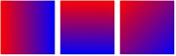

水平渐变 垂直渐变 对角渐变 

图 14-35 线性渐变刷

其实，线性渐变刷默认是按 WrapModeTile 平铺方式重复排列的（原点是 point1），例如（参见图 14-36 a））：

```
Graphics graph(pDC-&gt;m_hDC);
Point p1(10, 10), p2(110, 10), p3(10, 110);
Color col1(255, 0, 0), col2(0, 0, 255); 
LinearGradientBrush hbrush(p1, p2, col1, col2);
//hbrush.SetWrapMode(WrapModeTileFlipX); 
graph.FillRectangle(&hbrush, Rect(p1, Size(400, 200))); 
LinearGradientBrush vbrush(p1, p3, col1, col2);
//vbrush.SetWrapMode(WrapModeTileFlipX); 
graph.FillRectangle(&vbrush, Rect(Point(420, 10), Size(200, 410)));
LinearGradientBrush dbrush(p1, Point(110, 100), col1, col2);
//dbrush.SetWrapMode(WrapModeTileFlipX); 
graph.FillRectangle(&dbrush, Rect(Point(10, 220), Size(400, 200)));
```

你也可以将上面代码中的注释符“//”去掉，利用线性渐变刷类的方法

```
Status SetWrapMode(WrapMode wrapMode);
```

来设置画刷的排列方式为 WrapModeTileFlipX 平铺并水平翻转，参见图 14-36 b)。

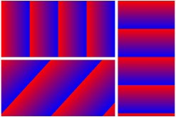

图 14-37 参数的含义

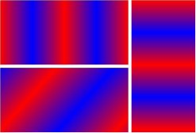

a) 平铺重复排列 b) 加水平翻转 

图 14-36 按平铺重复排列的线性渐变刷

下面是一个利用水平线性渐变刷来画阴阳八卦中的阴阳鱼例子（参见图 14-37 和图 14-38）：

```
LinearGradientBrush R2BBrush(Point(0, 10), Point(200, 10), Color(255, 0, 0), Color(0, 0, 255));
LinearGradientBrush B2YBrush(Point(0, 10), Point(200, 10),
Color(0, 0, 255), Color(255, 255, 0));
Pen bluePen(Color(255, 0, 0, 255));
Rect circleRect(0, 0, 200, 200);
Rect leftRect(0, 50, 100, 100);
Rect rightRect(100, 50, 100, 100); Graphics graph(pDC-&gt;m_hDC);
graph.FillPie(&R2BBrush, circleRect, 0.0f, 180.0f);
graph.FillPie(&B2YBrush, circleRect, 180.0f, 180.0f); 
graph.FillPie(&R2BBrush, leftRect, 180.0f, 180.0f); 
graph.FillPie(&B2YBrush, rightRect, 0.0f, 180.0f); int r = 10;
graph.FillEllipse(&SolidBrush(Color(0, 255, 0)), 50 - r, 100 - r, 2 * r, 2 * r);
graph.FillEllipse(&SolidBrush(Color(255, 0, 255)), 150 - r, 100 - r, 2 * r, 2 * r);
```

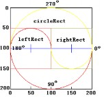


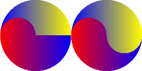


图 14-38 绘制阴阳鱼的分步输出结果

2）多色渐变 线性渐变刷还有很多其他功能，例如可利用刷的方法：

```
Status SetInterpolationColors(const Color *presetColors, const REAL *blendPositions, INT count);
```

来设置多色渐变。其中，presetColors 为多色数组、blendPositions 为以百分比表示的对应混色点的位置（首、尾值必须为 0.0f 和 1.0f，中间的值应该按递增序排列）、count 为颜色和混 色点位的数目。例如（参见图 14-39）：

```
Color cols[] = {Color::Red, Color::Orange, Color::Yellow, Color::Green, Color::Cyan, Color::Blue, Color::Purple, Color::Magenta};
REAL bps[] = {0.0f, 0.15f, 0.3f, 0.45f, 0.6f, 0.75f, 0.875f, 1.0f};
LinearGradientBrush brush(Point(10, 10), Point(810, 10), Color::Black, Color::White);
brush.SetInterpolationColors(cols, bps, 8);
graph.FillRectangle(&brush, Rect(10, 10, 800, 100));
```


图 14-39 多色渐变 另外，也可以像纹理刷和条纹刷一样，设置线性渐变刷的渲染原点等。 路径渐变刷的内容，安排到下一章的第 15.1.2 小节中，在介绍过路径的基本概念和使用方法之后再来讲解。

## 1.8 文字

GDI+的文本排版和字体处理的功能比 GDI 的更加强大。特别是 Windows XP 及以上版本，提供了对 LCD（液晶）显示器的特殊优化功能，GDI+也提供了对应的 ClearType（清晰活字）文字处理技术，以增强字体的清晰度。另外，GDI+还提供了构造专用字体集的功能，可以包含私有的临时字体（不需预先安装到系统中）。

Windows 中使用的字体，一般是 TrueType（真实活字） 字体（TTF=TrueType Font），它是 1991 年 Apple 和 Microsoft 联合开发的一种字体技术，采用二次贝塞尔曲线来描述字符 的轮廓。


在 GDI+中，与文字相关的类有（参见图 14-40）：字体族类 FontFamily、字体类 Font 和字体集类 FontCollection 及其两个派生类 InstalledFontCollection （已安装字体集）和 PrivateFontCollection（专用字体集）。而在 GDI 中，则只有 CFont 一个字体类。

图 14-40 字体类的层次结构

### 1.8.1 字体

下面介绍字体族类 FontFamily 和字体类 Font 及相关参数。

（1）字体族类 FontFamily

字体族（font family）是一组具有同一字样（typeface），但是风格（style）不同的字体（font）。其中，字样是指字体的种类，如 Arial、Times New Roman、宋体、楷体_GB2312。 风格是指：正常（regular）、粗体（bold）、斜体（italic）、粗斜体（bold and italic）、下划线（underline）、删除线（strikeout）等。

1）构造函数

字体族类 FontFamily 有两个构造函数：

```
FontFamily( VOID); // 构造一个空字体族（少用）
// 构造具有指定名称 name，位于指定字体集 fontCollection 中的字体族
FontFamily(const WCHAR *name, const FontCollection *fontCollection = NULL);
```

只要不是使用专用字体集中的字体，一般不需要设置第二个输入参数，取默认的 NULL 即可。例如：

```
FontFamily fontFamily(L"宋体"); 或
FontFamily fontFamily(L"Times New Roman");
```

2）显示当前系统已装入的字体（族）名称

可先利用（字体集 FontCollection 的派生类）已安装字体集类 InstalledFontCollection 的 方法 GetFamilyCount 和 GetFamilies 来分别获取当前系统中已经安装字体集中字体族的数目 和对象指针：

```
INT GetFamilyCount( VOID) const;
Status GetFamilies(INT numSought, FontFamily *gpfamilies, INT *numFound) const;
```

然后再利用字体族类的方法 GetFamilyName 来获取每个字体族的名称：

```
Status GetFamilyName(WCHAR name[LF_FACESIZE], WCHAR language = LANG_NEUTRAL) const;
```

其中 LANG_NEUTRAL 表示采用中立语言，即用户的默认语言。

例如（可创建一个带滚动视图类的单文档 MFC 应用程序 Fonts，添加对 GDI+的支持， 输出结果如图 14-41 所示）：

```
void CFontsView::OnDraw(CDC* pDC) {
    ……
    InstalledFontCollection ifc; int n = ifc.GetFamilyCount();
    FontFamily *ffs = new FontFamily[n];
    int found;
    ifc.GetFamilies(n, ffs, &found); wchar_t name[LF_FACESIZE];
    Font font(L"宋体", 18);
    SolidBrush textBrush(Color::Black); 
    Graphics graph(pDC-&gt;m_hDC); wchar_t str[40];
    swprintf_s(str, 40, L"当前系统中，总共装有如下%d 种字体：", n);
    graph.DrawString(str, INT(wcslen(str)), &font, PointF(10.0f, 10.0f), &textBrush);
    for (int i = 0; i &lt; n; i++) { 
        ffs[i].**GetFamilyName**(name); 
        graph.DrawString(name, INT(wcslen(name)), &font,
            PointF(10.0f, 80.0f + 40 * i), &textBrush); 
        graph.DrawString(L"Font Family 字体族", 15,
            &Font(name, 18),
            PointF(300.0f, 80.0f + 40 * i), &textBrush);
    }
}
```


图 14-41 获取并显示当前系统的字体

注：如果想用程序将这些名称写入一个文本文件，需要注意 ofstream 不支持宽字符串的 流输出，可以用实例模板类 of**w**stream 来定义一个新的文件输出流类型。还可以采用 CFile 来输出，但要注意宽字符串采用的是 UTF-16 编码，需要在文本文件的开始处，添加用 0xFE 和 0xFF 这两个字节表示的 UTF-16 编码标志。

（2）字体类 Font

字体类 Font 的构造函数有 6 个，常用的是如下两个：

```
Font(const FontFamily *family, REAL emSize, INT style = FontStyleRegular, Unit unit = UnitPoint);
Font(const WCHAR *familyName, REAL emSize, INT style = FontStyleRegular, Unit unit = UnitPoint, const FontCollection *fontCollection = NULL);
```

其中的第一个构造函数，其第一个输入参数是字体族的指针，所以必须先创建字体族对象。

而第 2 个构造函数的第一个输入参数则是字体族（字样）的名称，不需要创建字体族对象， 并且还多了可以选择的字体集作为最后一个输入参数。其余的构造函数都与 API 中的字体 句柄、逻辑结构和 DC 中的当前字体有关，在 GDI 中已经讨论过。

注意：在使用 VC08 SP1 和 VC10 时，需要注释掉（默认）位于 c:\program files\microsoft visual studio 9.0\vc\include\目录中的 VC 头文件 comdef.h 中的第 309~315 行：

```
// hard-coded smart pointer defs
/*#if defined( IFontDisp_INTERFACE_DEFINED )
if_not_exists(Font)
{
    struct Font : IFontDisp {};
}
_COM_SMARTPTR_TYPEDEF(Font, uuidof(IDispatch));
#endif*/
```

不然，编译时会出现两个 Font 类定义冲突问题的错误。也可以不改 comdef.h，而在代码中 的每个 Font 类名的前面，都加上命名空间限定符“Gdiplus::”，如 Gdiplus::Font，不过这样 又太麻烦。

下面我们重点讨论第二个构造函数的使用，先介绍其中的各个参数。

1）字体种类 familyName（字体族名）—— 宽字符串表示的字体名称

+   常用的英文字体族名有：

    +   Times New Roman：Font Family Name 字体族名(有衬线)
    +   Arial： Font Family Name 字体族名(无衬线)
    +   Arial Narrow： Font Family Name 字体族名(窄体)
    +   Courier New： Font Family Name 字体族名(等宽)

+   常用的中文字体族名有：

    +   宋体： Font Family Name 字体族名(正文)
    +   楷体_GB2312： Font Family Name 字体族名(正文、标题)
    +   黑体： Font Family Name 字体族名(标题、美术)
    +   仿宋_GB2312： Font Family Name 字体族名(标题、美术)
    +   隶书： Font Family Name 字体族名(标题、美术)

2）字体风格 style—— 字体的风格，可以取如下枚举常量（默认为 FontStyleRegular）： 

```
typedef enum {
    FontStyleRegular = 0, // 正常（默认值）
    FontStyleBold = 1, // 粗体 
    FontStyleItalic = 2, // 斜体 
    FontStyleBoldItalic = 3, // 粗斜体 
    FontStyleUnderline = 4, // 下划线
    FontStyleStrikeout = 8 // 删除线
} FontStyle;
```

3）字体单位 unit 与大小 emSize——字体的大小与有单位关，可用单位有： 

```
typedef enum {
    UnitWor ld = 0, // 逻辑单位（非物理单位，默认为像素）
    UnitDisplay = 1, // 设备单位，如对显示器为像素、对打印机为墨点 
    UnitPixel = 2, // 像素（1/54 或 1/96 英寸？与屏幕大小和分辨率有关） 
    UnitPoint = 3, // 点或 1/72 英寸（默认值）
    UnitInch = 4, // 英寸 
    UnitDocument = 5,../300 英寸 
    UnitMillimeter = 6 // 毫米 mm
} Unit;
```

其中，em = M，在印刷行业中表示一个西文印刷符号的全长或全宽。

在 GDI 的 CFont 部分，已经介绍了中文字号与英文磅数（相当于这里的 UnitPoint 点值） 的关系，表 14-1 列出了中文字号与几种主要 Unit 单位的关系（设 1 像素=1/54 英寸）。

表 14-1 中文字号与 Unit 单位的关系

| 汉字字号 | Pixel像素 | Point点 | Inch英寸 | Document文档 | Millimeter毫米 |
| --- | --- | --- | --- | --- | --- |
| 特号 | 133.33 | 100 | 1.39 | 416.67 | 35.28 |
| 小特 | 80 | 60 | 0.83 | 250 | 21.17 |
| 初号 | 56 | 42 | 0.58 | 175 | 14.82 |
| 小初 | 48 | 36 | 0.5 | 150 | 12.7 |
| 一号 | 34.67 | 26 | 0.36 | 108.33 | 9.17 |
| 小一 | 32 | 24 | 0.33 | 100 | 8.47 |
| 二号 | 29.33 | 22 | 0.31 | 91.67 | 7.76 |
| 小二 | 24 | 18 | 0.25 | 75 | 6.35 |
| 三号 | 21.33 | 16 | 0.22 | 66.67 | 5.64 |
| 小三 | 20 | 15 | 0.21 | 62.5 | 5.29 |
| 四号 | 18.67 | 14 | 0.19 | 58.33 | 4.94 |
| 小四 | 16 | 12 | 0.17 | 50 | 4.23 |
| 五号 | 14 | 10.5 | 0.15 | 43.75 | 3.70 |
| 小五 | 12 | 9 | 0.125 | 37.5 | 3.175 |
| 六号 | 10 | 7.5 | 0.10 | 31.25 | 2.65 |
| 小六 | 8.67 | 6.5 | 0.09 | 27.08 | 2.29 |
| 七号 | 7.33 | 5.5 | 0.08 | 22.92 | 1.94 |
| 八号 | 6.67 | 5 | 0.07 | 20.83 | 1.76 |

例如（参见图 14-42）：

```
REAL fs[] = {100, 60, 42, 36, 26, 24, 22, 18, 16, 15, 14, 12,
    10.5, 9, 7.5, 6.5, 5.5, 5};
CString fno[] = {L"特", L"小特", L"初", L"小初", L"一",
    L"小一", L"二", L"小二", L"三", L"小三", L"四", L"小四",
    L"五", L"小五", L"六", L"小六", L"七", L"八"};
wchar_t str[100]; REAL size, y = 10.0f;
SolidBrush textBrush(Color::Black); 
Graphics graph(pDC->m_hDC);
for (int i = 0; i &lt; 18; i++) { 
    size = fs[i]; swprintf_s(str, 100,
        L"这是%s 号字(%.4g 像素 %g 点 %.4g 英寸 %.4g 文档 %.4g 毫米)",
        fno[i], size * 4 / 3.0, size, size / 72.0,
        size * 300 / 72.0, size / 72.0 * 25.4); 
    graph.DrawString(str, INT(wcslen(str)),
        &Font(L"宋体", size), PointF(10.0f, y), &textBrush);
    y += size * 1.5f;
}
```


图 14-42 中文字号与 Unit 单位

### 1.8.2 绘制文本

在 GDI 中，我们用 CDC 类的方法 TextOut、DrawText 和 ExtTextOut 等来输出文本串。 在 GDI+中，我们则是利用 Graphics 类的重载方法 DrawString 来绘制文本。

（1）画串方法 DrawString

```
Status DrawString(const WCHAR *string, INT length, const Font *font, const PointF &origin, const Brush *brush);
Status DrawString(const WCHAR *string, INT length, const Font *font, const PointF &origin, const StringFormat *stringFormat, const Brush *brush);
Status DrawString(const WCHAR *string, INT length, const Font *font, const RectF &layoutRect, const StringFormat *stringFormat, const Brush *brush);
```

这三个同名的 Graphics 类重载方法，都以宽字符串作为第一个输入参数（不支持普通 字符串）、串长为第二个参数（对以 null 结尾的字符串，可以使用-1 来代替）、最后一个参 数则都是绘制文本用的画刷指针。

不同的是第三个输入参数（都是浮点数版本，不支持整数版本）：前两个方法的是浮点 数版的点类 PointF 对象，表示文本串的位置（默认是左上角）；最后一个方法的是浮点数版 的矩形类 RectF 对象，表示绘制文本的范围（超出部分会被截掉）。

另 一 个不 同之 处是 ，后 两个 方法 比第 一个 方法 多了 一个 输入 参数 —— 串格 式 类 StringFormat 对象的指针，用于设置文本的对齐方式、输出方向、自动换行、制表符定制、 剪裁等。

第一个画串方法最简单，使用得也最多。例如：

```
graph.DrawString(str, INT(wcslen(str)), &Font(L" 宋体 ", 12), PointF(10.0f, 10.0f), &brush);
graph.DrawString(str, -1, &font, &rect, &stringFormat, &brush);
```

（2）串格式类 StringFormat

StringFormat 是从 Gdiplus Base 类直接派生的一个 GDI+类，用于设置绘制字符串时的各 种格式。其主要的构造函数为：

```
StringFormat(INT formatFlags = 0, LANGID language = LANG_NEUTRAL);
```

其中：

formatFlags（格式标志位）—— 用于设置各种输出格式，取值为 StringFormatFlags 枚举的下列常量之位或“|”：

```
typedef enum {
    StringFormatFlagsDirectionRightToLeft = 0x00000001, // 方向从右到左（默认为从左到右） 
    StringFormatFlagsDirectionVertical = 0x00000002, // 垂直方向（默认为水平） 
    StringFormatFlagsNoFitBlackBox = 0x00000004, // 允许字符尾部悬于矩形之外 
    StringFormatFlagsDisplayFormatControl = 0x00000020, // Unicode 布局控制符起作用 
    StringFormatFlagsNoFontFallback = 0x00000400, // 有替换用的“缺少字体”（默认为开方形符） 
    StringFormatFlagsMeasureTrailingSpaces = 0x00000800, // 测量时包含尾部空格符（默认不包含）
    StringFormatFlagsNoWrap = 0x00001000, // 不自动换行
    StringFormatFlagsLineLimit = 0x00002000, // 最后一行必须为整行高，避免半行高的输出
    StringFormatFlagsNoClip = 0x00004000 // 不使用剪裁
} StringFormatFlags;
```

language （语言） —— 取值为 16 位 语 言 标识 符 类 型 LANGID ， 默认 值为 LANG_NEUTRAL（语言中立），表示采用用户的默认语言。

（3）输出方向

默认的文本串输出方向是从左到右水平绘制。也可以在 StringFormat 类的构造函数中使 用参数值：StringFormatFlagsDirectionRightToLeft 和 StringFormatFlagsDirectionVertical 来修 改文本串的输出方向为从右到左水平绘制和从上到下垂直绘制。

（4）剪裁与换行

默认情况下，使用矩形输出长文本串时，会自动换行和剪裁。但是也可以在 StringFormatF 类的构造函数中，利用第一个输入参数的 StringFormatFlags 枚举值，来改变默认的设置。

（5）对齐

可以通过 StringFormat 类的方法来设置输出文本串的对齐方式： 

```
Status SetAlignment(StringAlignment align); // 设置水平对齐 
Status SetLineAlignment(StringAlignment align); // 设置垂直对齐
```

其中的输入参数为枚举常量：

```
typedef enum {
    StringAlignmentNear = 0, // 靠近（左上） 
    StringAlignmentCenter = 1, // 中心（对中） 
    StringAlignmentFar = 2 // 远离（右下）
} StringAlignment;
```

### 1.8.3 美术字

下面介绍阴影、条纹、纹理、渐变、空心字和彩心字等绘制美术字的方法，它们是利用不同颜色、条纹和渐变的画刷，以及多次绘图的方式，来实现特定美术效果的。

（1）阴影字

可以使用两种不同颜色的画刷，经过在不同的为位置多次绘制同一文本串，就可以达到 输出阴影字的效果。例如（参见图 14-43）：

```
Graphics graph(pDC-&gt;m_hDC);
SolidBrush textBrush(Color::Red), shadowBrush(Color::Gray); HatchBrush hatchBrush(HatchStyleForwardDiagonal,
    Color::Black, Color::White);
CString str = L"阴影字符串"; 
Font font(L"华文新魏", 100);
REAL d = 10.0f, dd = 5.0f;
graph.DrawString(str, str.GetLength(), &font, PointF(d + dd, d + dd), &shadowBrush);
graph.DrawString(str, str.GetLength(), &font, PointF(d, d), &textBrush);
for (int i = 0; i &lt; 20; i++) 
    graph.DrawString(str, str.GetLength(), &font,
        PointF(d + i, 150 + d + i + 2), &hatchBrush);
```


```
graph.DrawString(str, str.GetLength(), &font, PointF(d, 150 + d), &textBrush);
```

图 14-43 阴影字

（2）条纹字

也可以直接利用条纹刷，来绘制条纹状的字符串。例如（参见图 14-44）：

```
Graphics graph(pDC-&gt;m_hDC); 
CString str = L"条纹字符串"; 
Font font(L"华文新魏", 140);
HatchBrush hatchBrush1(HatchStyleForwardDiagonal, Color::Red, Color::White);
graph.DrawString(str, str.GetLength(), &font, PointF(0.0f, 0.0f), &hatchBrush1);
HatchBrush hatchBrush2(HatchStyleBackwardDiagonal, Color::Green, Color::White);
graph.DrawString(str, str.GetLength(), &font, PointF(0.0f, 200.0f), &hatchBrush2);
HatchBrush hatchBrush3(HatchStyleCross, Color::Blue, Color::White);
graph.DrawString(str, str.GetLength(), &font, PointF(0.0f, 400.0f), &hatchBrush3);
```


图 14-44 条纹字

（3）纹理字

还可以利用纹理（图像）刷来绘制纹理字符串。例如（参见图 14-45）：

```
Graphics graph(pDC-&gt;m_hDC); 
CString str = L"纹理字符串"; 
Font font(L"华文新魏", 140);
TextureBrush textureBrush(&Image(L"张东健.bmp"));
graph.DrawString(str, str.GetLength(), &font, PointF(10.0f, 10.0f), &textureBrush);
```


图 14-45 纹理字

（4）渐变字

当然，也可以利用线性渐变刷来绘制色彩变幻的字符串。例如，使用前面的多色渐变刷 代码，可以得到很好的变色效果（参见图 14-46）：

```
Graphics graph(pDC-&gt;m_hDC); 
CString str = L"颜色渐变字符串"; 
Font font(L"华文新魏", 100);
Color cols[] = {Color::Red, Color::Orange, Color::Yellow, Color::Green, Color::Cyan, Color::Blue, Color::Purple, Color::Magenta};
REAL bps[] = {0.0f, 0.15f, 0.3f, 0.45f, 0.6f, 0.75f, 0.875f, 1.0f};
LinearGradientBrush brush(Point(10, 10), Point(810, 10), Color::Black, Color::White);
brush.SetInterpolationColors(cols, bps, 8); 
graph.DrawString(str, str.GetLength(), &font, PointF(10.0f, 10.0f), &brush);
```


图 14-46 渐变字

（5）空心字与彩心字

还可以利用 GDI+的路径和路径渐变刷，来绘制空心和彩心字符串。例如（参见图 14-47）：

```
Graphics graph(pDC-&gt;m_hDC); 
FontFamily ff(L"隶书"); 
wchar_t str[] = L"测试字符串";
REAL emSize = 120; // UnitWorld 
graph.DrawString(str, -1, &Font(L"隶书", emSize, FontStyleRegular, UnitWorld), PointF(0, 0),
&SolidBrush(Color::Green));
GraphicsPath path, *pOutlinePath;
path.AddString(str, -1, &ff, FontStyleRegular, emSize, Point(0, 100), NULL); // 847 个点
Pen pen(Color::Red); graph.DrawPath(&pen, &path); 
pOutlinePath = path.Clone(); 
pOutlinePath-&gt;Outline(); 
PathGradientBrush pgBrush(pOutlinePath);
int n = pOutlinePath-&gt;GetPointCount(); // 1023 个点
Color *cols = new Color[n];
for (int i = 0; i &lt; n; i++) 
    cols[i] = Color(rand() % 255, rand() % 255, rand() % 255);
pgBrush.SetCenterColor(Color(rand() % 255, rand() % 255, rand() % 255)); 
pgBrush.SetSurroundColors(cols, &n); 
graph.TranslateTransform(0.0f, 100.0f); 
graph.FillPath(&pgBrush, &path);
```

中，由于彩心字用到了随机颜色，所以每次刷新时的颜色都不一样。


图 14-47 普通、空心和彩心字符串

### 1.8.4 平滑处理与 ClearType 技术

为了提高文字的清晰度，需要对绘制的文本串进行平滑处理，防止在（特别是点阵）文 字被放大后出现明显的锯齿（马赛克 mosaic）现象。ClearType（清晰活字）是微软公司于 1999 年 4 月 7 日推出的一种图形显示技术，主要用于改善 LCD（Liquid Crystal Display，液 晶显示）显示器的显示效果，提高图形和文字的清晰度。

可以在 GDI+程序中，利用 Graphics 类的两个文本绘制提示（hint）方法：

```
TextRenderingHint GetTextRender ingHint(VOID) const; 
Status SetTextRenderingHint(TextRender ingHint newMode);
```

来获取和设置文字绘制时的平滑处理方法。其中的枚举类型 TextRenderingHint 的定义为：

```
typedef enum {
    TextRenderingHintSystemDefault = 0, // 同系统平滑方式 
    TextRenderingHintSingleBitPerPixelGr idFit = 1, // 不消锯齿，网格匹配 
    TextRenderingHintSingleBitPerPixel = 2, // 不消锯齿，不网格匹配 
    TextRenderingHintAntiAliasGridFit = 3, // 消锯齿，网格匹配 
    TextRenderingHintAntiAlias = 4, // 锯齿，不网格匹配
    TextRenderingHintClearTypeGridFit = 5 // 使用 ClearType 技术，不网格匹配
} TextRenderingHint;
```

这里的网格匹配（grid fit），主要是指在文本绘制时，通过调整字形的平直和垂直笔画的宽 度，以达到提高文字输出质量的一种方法。

例如（输出结果如图 14-48，为放大后的效果）：

```
Graphics graph(pDC-&gt;m_hDC);
SolidBrush textBrush(Color::Black); 
Font font(L"Arial", 16);
CString str = L"font smoothing"; 
wchar_t buf[5];
for (int i = 0; i &lt; 6; i++) {
    _itow_s(i, buf, 5, 10); 
    graph.SetTextRenderingHint(TextRenderingHint(i)); 
    graph.DrawString(buf, -1, &font, PointF(5.0f, 20.0f * i), &textBrush);
    graph.DrawString(str, str.GetLength(), &font, PointF(30.0f, 20.0f * i), &textBrush);
}
```


图 14-48 文字绘制时的平滑处理方式 细心的同学可能会发现，除了渐变和路径刷及平滑处理外，大多数文本输出功能，GDI

都有。而且 GDI 还可以以任意角度绘制文本串，但是 GDI+好像不能。其实，这可以利用 GDI+的矩阵变换来实现。矩阵变换的内容，会在后面的 14.2.8 小节介绍。

专用字体集

如果你想使用系统中还没有被安装的字体，有如下两种方法可供选择。

（1）手工安装字体

选择 Windows XP 操作系统的“../控制面板/字体”图标，启动“字体”程序； 然后再选择“文件/安装新字体”菜单项，打开“添加字体”对话框（参见图 14-49）；选择 字体所在的文件目录，会出现目录中所有字体的名称和类型列表；选中想安装的字体后，按 确定关闭对话框。这样，就完成了字体的安装工作。将字体装进系统后，就可以和其他已装 入字体一样正常使用了。


图 14-49 添加字体对话框

（2）使用专用字体集

与已安装字体集类 InstalledFontCollection 一 样 ， 专 用 （ 私 有 ） 字 体 集 类 PrivateFontCollection 也是字体集类 FontCollection 的派生类。

PrivateFontCollection 类只有一个构造一个空的字体集默认构造函数：

```
PrivateFontCollection(VOID);
```

但是可用方法 AddFontFile 来向字体集中添加字体文件：

```
Status AddFontFile(const WCHAR* filename);
```

将字体文件加入专用字体集后，我们就可以利用其父类的方法

```
Status GetLastStatus(VOID);
```

和 GetFamilyCount、GetFamilies 等，来判断装入是否成功、字体集中共有多少种字体、获 取指定数目的字体族 FontFamily 对象的数组（指针）。这些都与前面“显示当前系统已装入 的字体（族）名称”部分所讲的类似。包括用 FontFamily 类的 GetFamilyName 方法获取字 体名称，并用该名称来创建字体对象（使用带字体集参数的构造函数），最后绘制文本串。

下面的例子，使用汉鼎繁印篆和汉鼎繁特行两种专用字体，输出文本串“专用字体集： 字体名称”和诗句“三顾频烦天下计 两朝开济老臣心”（参见图 14-50）。这两种字体所对应的字体文件 HDZB_25.TTF 和 HDZB_16.TTF，已经放入我个人网页的资源子目录 res 中。

你也可以自己从网上下载其他字体文件来进行试验。

```
// 装入专用字体文件 
PrivateFontCollection pfc; 
pfc.AddFontFile(L"res\\HDZB_16.TTF");
if(pfc.GetLastStatus() != Ok)
{ 
    MessageBox(L"装入字体文件出错！"); 
    return; 
} 
pfc.AddFontFile(L"res\\HDZB_25.TTF");
if(pfc.GetLastStatus() != Ok)
{ 
    MessageBox(L"装入字体文件出错！"); 
    return; 
} 
int n = pfc.GetFamilyCount();
if (n &lt; 2) 
{ 
    MessageBox(L"字体集中的字体数不够！"); 
    return; 
}
// 获取字体族对象数组 
FontFamily ffs[2]; 
int found;
pfc.GetFamilies(2, ffs, &found);
// 定义输出字符串
CString str0 = L"专用字体集：", str;
CString str1 = L"三顾频烦天下计\r\n 两朝开济老臣心";
// 设置中对齐
StringFormat stringFormat; 
stringFormat.SetAlignment(StringAlignmentCenter); 
RECT rect;
GetClientRect(&rect);
// 创建图形和文本刷对象
Graphics graph(pDC->m_hDC); 
SolidBrush textBrush(Color::Black);
// 获取字体名称 1，构造字体 1，并输出字符串
wchar_t name[LF_FACESIZE]; 
ffs[0].GetFamilyName(name);
Font font1(name, 60, FontStyleRegular, UnitPixel, &pfc); 
str = str0 + name;
graph.DrawString(str, str.GetLength(), &font1, PointF(0.0f, 0.0f), &textBrush);
graph.DrawString(str1, str1.GetLength(), &font1, 
    PointF(rect.right / 2.0f, 80.0f), &stringFormat,
    &textBrush);
// 获取字体名称 2，构造字体 2，并输出字符串 ffs[1].GetFamilyName(name);
Font font2(name, 60, FontStyleRegular, UnitPixel, &pfc); 
str = str0 + name;
graph.DrawString(str, str.GetLength(), &font2,
    PointF(0.0f, 220.0f), &textBrush); graph.DrawString(str1, str1.GetLength(), &font2,
    PointF(rect.right / 2.0f, 300.0f), &stringFormat,
    &textBrush);
```


图 14-50 使用汉鼎繁印篆和汉鼎繁特行专用字体

## 复习思考题

1\. GDI+与 GDI 是什么关系？

2\. GDI+有哪两种封装？它们的基础是什么？

3\. GDI+有哪些新增功能？

4\. GDI+的绘图方式与 GDI 有什么不同？

5\. 用 MFC 编写 GDI+程序需要做那些装备工作？对 VC08 SP1 及 VC10 版有什么不同？

6\. 如何对 GDI+进行初始化和清除？需要特别注意什么？

7\. 怎么解决 GDI+编程中 new 操作符问题？

8\. GDI+的几何辅助类与 GDI 的有哪些不同？

9\. 与 GDI 相比，GDI+的颜色哪些新内容？

10\. 有多少颜色枚举常量？如何使用它们？GDI+的 Graphics 类与 GDI 的 MFC 封装中的什么类相似？怎样创建 Graphics 对象？

13\. GDI+的绘图方法属于哪个类？

14\. GDI+的画线方法的名称都有什么共同的前缀？

15\. GDI+的画直线、矩形和椭圆的方法与 GDI 的对应方法有哪些不同？

16\. GDI+中的画填充图的方法都有什么共同的前缀？有例外吗？

17\. GDI+画填充多边形有哪两种填充模式？它们的差别在哪里？

18\. GDI+提供了哪两种由控制点列画曲线的方法？它们有什么差别？

19\. GDI+中有专门的清屏方法吗？GDI 中有没有？

20\. 与 GDI 相比，GDI+中的笔增加了哪些新功能？

21\. GDI+的条纹刷和纹理刷与 GDI 相比有哪些新加内容？

22\. GDI+新增加了哪些画刷种类？

23\. GDI+中有哪些字体类？

24\. 在 VC08 SP1 及 VC10 中直接使用 Font 类会出现什么编译错误？如何解决？

25\. 在 GDI+中如何使用字体？

26\. GDI+使用什么方法绘制文本？

27\. 如何实现阴影、条纹、纹理、渐变、空心和彩心等绘制美术字效果？

28\. 如何使用专用字体集？

## 练习题

1\. （选做题，例子）实现本章中的各例。

2\. （正叶曲线）编写一个画填充正叶曲线的通用程序。可以指定叶片数、颜色、圆心和叶长（半径）等。（参见 14.7.2 的 2．和图 14-31）

3\. （阴阳八卦图）编写一个绘制阴阳八卦图的通用程序。可指定各种颜色、圆心和半径等 等，参见图 14-51。


图 14-51 阴阳八卦图

4\. （选做题，交互绘图）编写一个使用 GDI+接口的交互式绘图程序，实现 GDI+的所有 基本功能和各种新增加的功能。（提示，可以用 GDI 交互移动，用 GDI+成图。）

5\. （选做题，补充绘图方法）编写若干（带不同类型输入参数的）画（线框和填充）弓弦 和 圆 角 矩 形 的 GDI+ 方法 （ DrawChord 、 FillChord 、 DrawRoundRectangle 和 FillRoundRectangle）。

6\. （选做题，色块）绘制颜色枚举常量色块图。